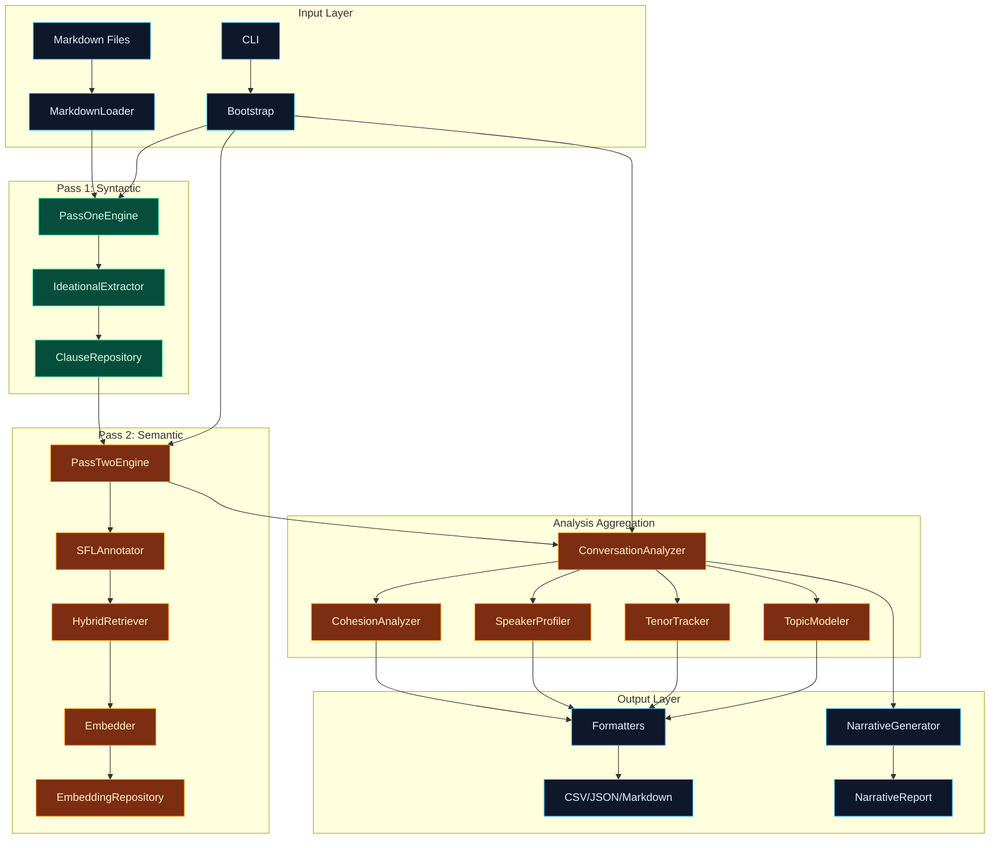

# SFL-Compiler

> **sfl-compiler transforms** conversation and documentation text **into** Systemic Functional Linguistics (SFL) analyses **through** a two-pass pipeline (spaCy syntactic parsing + LLM interpersonal annotation) **for** researchers, developers, and AI agents seeking linguistic pattern discovery in codebase conversations.

---

## What This Codebase Produces *(Material Processes — High Certainty)*

sfl-compiler **transforms** raw conversation markdown and documentation text **into** structured SFL analyses **through** a multi-stage extraction pipeline **when** provided with configured LLM access and PostgreSQL storage.

**Technical Contract**:
- **Input**: Conversation markdown files, documentation repositories, or text corpora
- **Process**: Pass 1 (spaCy syntactic parsing → Ideational extraction) → Pass 2 (LLM interpersonal annotation → Mood/Modality/Tenor + Textual Theme/Rheme) → Analysis aggregation (Cohesion metrics, Key Moments, Example Passages)
- **Output**: JSON/CSV/Markdown reports with per-clause SFL annotations, turn-level aggregations, speaker profiles, topic models, cohesion metrics, narrative reports
- **Performance**: Typically processes 50-100 clauses per minute (LLM-dependent); pipeline caching enables resume after interruptions; pgvector indexing supports semantic retrieval

---

## Key Concepts *(Most-Connected Nodes from GRAPH_REPORT.md)*

| Concept | Role | Connected To | Confidence |
|---------|------|-------------|------------|
| `PassTwoEngine` | Core LLM annotation engine for interpersonal metafunction | ConversationAnalyzer, PipelineCache, DSPySignatures, HybridRetriever | EXTRACTED |
| `PipelineCache` | Disk-based cache for Pass 1 + Pass 2 results enabling resume | PassTwoEngine, ClauseRepository, PipelineOrchestration | EXTRACTED |
| `ConversationAnalyzer` | Aggregates clause-level annotations into turn-level metrics | PassTwoEngine, SpeakerProfiler, TenorTracker, CohesionAnalyzer | EXTRACTED |
| `MarkdownFormatter` | Produces markdown reports with data quality sections | ConversationAnalyzer, CSVFormatter, JSONFormatter | EXTRACTED |
| `DocumentationAnalyzer` | Analyzes documentation with SFL lens | ConversationAnalyzer, TenorTracker, PassOneEngine | EXTRACTED |
| `IdeationalExtractor` | Extracts process types, participants, circumstances from syntax | PassOneEngine, ClauseRepository | EXTRACTED |
| `Digest` | Data structure for analysis results | NarrativeGenerator, Formatters | EXTRACTED |

*Source: graphify god nodes — highest-degree nodes in the knowledge graph (83% EXTRACTED, 17% INFERRED).*

---

## Architecture Overview *(Relational Processes)*

The sfl-compiler follows a **layered extraction pipeline** architecture with clear separation between syntactic parsing (Pass 1), semantic annotation (Pass 2), and analysis aggregation.



---

## Community Structure

The codebase is organized into **28 functional communities** identified by graphify's clustering algorithm:

| Community | Cohesion | Key Components | Purpose |
|-----------|----------|----------------|---------|
| **Bootstrap & Configuration** | 0.08 | Configuration, api_key_for, configure_llm, connect_db | LLM and database setup |
| **Pass Two Engine (LLM)** | 0.13 | PassTwoEngine, SFLAnnotator, SFLBatchAnnotator | Interpersonal metafunction annotation |
| **Narrative Generator** | 0.10 | NarrativeGenerator, Digest, CSVFormatter, NarrativeFormatter | Human-readable narrative reports |
| **Correlation Analysis** | 0.10 | CorrelationAnalyzer, SpeakerProfiler | Process type correlations with tenor/modality |
| **Conversation Analysis** | 0.13 | ConversationAnalyzer, Pipeline | Turn-level aggregation and analysis |
| **Topic Modeling** | 0.11 | TopicModeler, MarkdownLoader | Topical clustering of clauses |
| **Documentation Analysis** | 0.13 | DocumentationAnalyzer, TenorTracker | Documentation corpus analysis |
| **CLI Interface** | 0.11 | run_conversation, run_documentation, run_context | Command-line entry points |
| **Context Synthesis** | 0.13 | ContextSynthesizer, HybridRetriever, Embedder | Semantic context for analysis |
| **Hybrid Retriever** | 0.11 | HybridRetriever, Embedder, EmbeddingRepository | Vector + keyword retrieval |
| **Clause Repository** | 0.17 | ClauseRepository, extract_with_llm | Syntactic clause storage |
| **Pipeline Cache** | 0.13 | PipelineCache | Resume capability after failures |
| **Formatters** | 0.20 | CSVFormatter, JSONFormatter, MarkdownFormatter | Output serialization |
| **Types & Schemas** | 0.67 | AnnotatedClause, TextualPayload, InterpersonalPayload | Data structures |
| **Cohesion Analysis** | 0.11 | CohesionAnalyzer | Textual metafunction metrics |
| **Pipeline Orchestration** | N/A | Pipeline | Multi-stage processing coordination |

---

## Surprising Connections

The following cross-module relationships were identified as unexpected but significant:

1. **`extract_with_llm()` → `parse()`** *(INFERRED)*: Theme/Rheme extraction (experimental) calls the main parsing pipeline, suggesting reuse of syntactic analysis infrastructure for textual metafunction extraction.

2. **`call()` → `config()`** *(INFERRED)*: Bootstrap's main entry point coordinates with configuration, indicating tight coupling between initialization and LLM setup.

3. **`connect()` → `config()`** *(INFERRED)*: Database connection depends on configuration, showing unified setup flow.

4. **`run_context()` → `config()`** *(INFERRED)*: Context synthesis commands require configuration state.

*These connections have high betweenness centrality, acting as bridges between communities.*

---

## What Varies by Context *(Mental Processes — Conditional Modality)*

- **Simple scenarios**: Users **typically** analyze small conversation files (50-100 clauses) **and** receive results within 1-2 minutes **when** using local LLM endpoints.
- **Complex cases may**: Require resume functionality after LLM timeouts **or** benefit from pipeline caching **when** processing large codebases with repeated patterns.
- **Results depend on**: LLM provider quality and latency, PostgreSQL pgvector extension availability, input text syntactic complexity.

---

## Questions This Graph Can Answer

*From GRAPH_REPORT.md suggested questions:*

1. **Why does `parse()` connect multiple communities?**
   *High betweenness centrality (0.098) — this node is a cross-community bridge between Bootstrap, Narrative Generator, CLI Interface, Pipeline Cache, and Clause Repository.*

2. **Why does `config()` connect CLI Interface to Bootstrap & Configuration?**
   *High betweenness centrality (0.091) — configuration state flows from bootstrap to all CLI commands.*

3. **Why does `PassTwoEngine` connect Pass Two Engine to CLI Interface?**
   *High betweenness centrality (0.085) — LLM annotation is the core operation triggered by CLI commands.*

4. **What connects isolated nodes (42 found) to the rest of the system?**
   *Weakly-connected nodes like ThemeRhemeSignature, Error types, PassOneError require manual verification of their integration points.*

---

## Ruby Pragmatist Overview

The sfl-compiler works like a **linguistic MRI scanner** — it **maps the structural anatomy of conversation (processes, participants, circumstances) with surgical precision** through spaCy's syntactic parsing, **while the semantic soft tissue (mood, modality, tenor, theme) requires LLM interpretation and may vary by provider and prompt quality**, much like how an MRI reveals bone structure clearly but needs a radiologist to interpret the subtle variations in soft tissue.

---

## Getting Started

### Prerequisites
- Ruby 3.2+
- PostgreSQL 14+ with pgvector extension
- Python 3.10+ (for spaCy)
- Ollama or OpenAI API access

### Installation
```bash
# Clone and setup
bundle install

# Install spaCy model
python -m spacy download en_core_web_lg

# Setup database
createdb sfl_compiler_development
psql sfl_compiler_development -c "CREATE EXTENSION vector;"

# Configure LLM (Ollama example)
export OLLAMA_BASE_URL=http://localhost:11434

# Observability (optional): tracing to Langfuse via OpenTelemetry.
# Set in .env before running — see docs/guides/USAGE.md#observability-optional.
export LANGFUSE_PUBLIC_KEY=pk-lf-...
export LANGFUSE_SECRET_KEY=sk-lf-...
```

### Basic Usage
```bash
# Analyze a conversation
bundle exec sfl-analyze conversation input.md --output-dir ./output

# Generate narrative report
bundle exec sfl-analyze conversation input.md --output-dir ./output --narrative

# Document a codebase
bundle exec sfl-analyze documentation ./ --output-dir ./output

# Skip Langfuse tracing for this run, regardless of .env
bundle exec sfl-analyze conversation input.md --output-dir ./output --disable-tracing
```

---

## Directory Structure

```
.
├── bin/                    # CLI executables
├── lib/
│   ├── sfl/
│   │   └── compiler/
│   │       ├── cli.rb              # Command-line interface
│   │       ├── bootstrap.rb        # Configuration and setup
│   │       ├── pass_one/           # spaCy-based Ideational extraction
│   │       │   └── ideational_extractor.rb
│   │       ├── pass_two/           # LLM-based Interpersonal + Textual
│   │       │   └── pass_two_engine.rb
│   │       ├── retrieval/          # Vector retrieval infrastructure
│   │       │   ├── embedder.rb
│   │       │   └── hybrid_retriever.rb
│   │       ├── storage/           # Database repositories
│   │       │   ├── clause_repository.rb
│   │       │   ├── embedding_repository.rb
│   │       │   └── pipeline_cache.rb
│   │       ├── analysis/          # Aggregation analyzers
│   │       │   ├── conversation_analyzer.rb
│   │       │   ├── cohesion_analyzer.rb
│   │       │   ├── speaker_profiler.rb
│   │       │   ├── tenor_tracker.rb
│   │       │   └── topic_modeler.rb
│   │       └── types.rb           # Data structures
├── spec/                   # RSpec tests
├── graphify-out/          # Knowledge graph outputs
└── docs/                   # Generated documentation
```

---

## License

MIT License — see LICENSE file for details.
