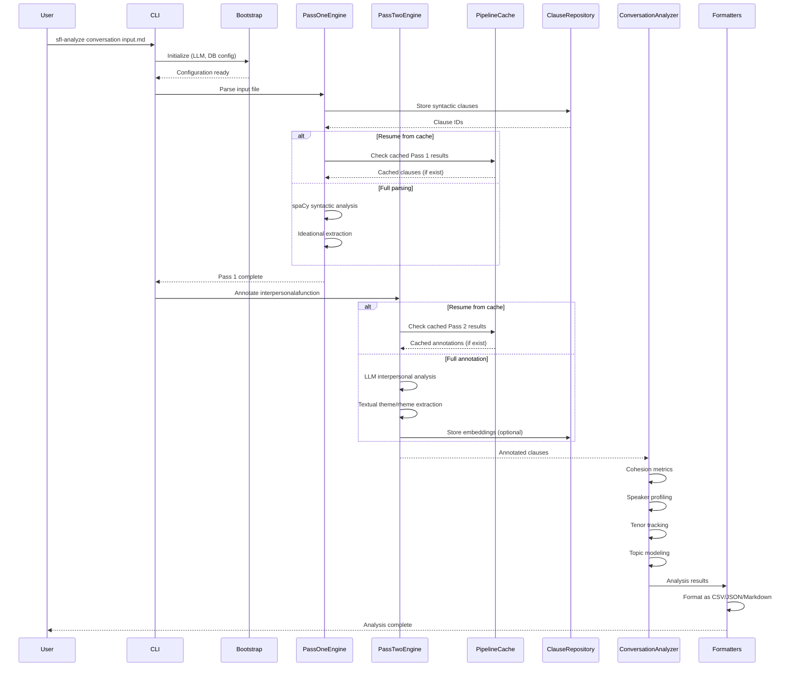
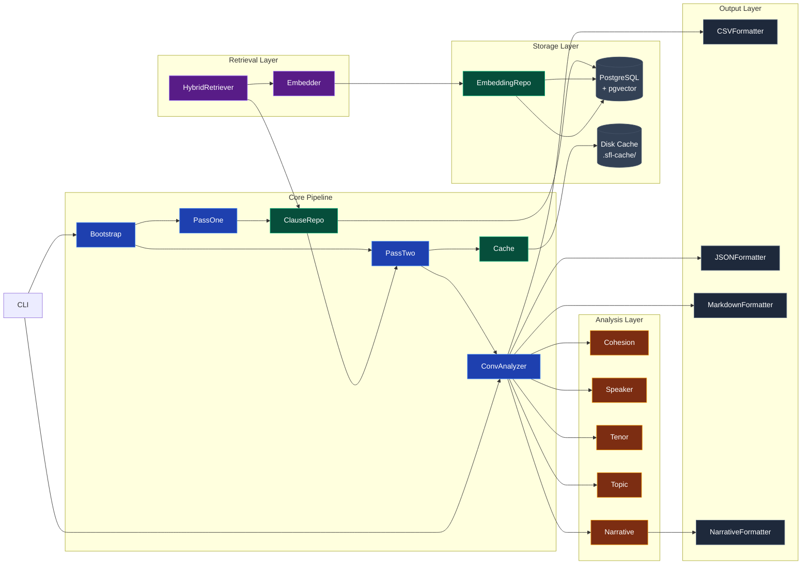

# Architecture

The sfl-compiler architecture **prioritizes** separation of concerns between syntactic parsing, semantic annotation, and analysis aggregation **through** a clean layered design **while** acknowledging the tight coupling between LLM configuration and pipeline execution.

---

## Component Relationship Map *(Relational Processes — High Certainty)*

### System Relationship Map

```shell
[CLI Entry Points] ←→ [Bootstrap & Configuration] ←→ [Pipeline Orchestration]
         ↓                     ↓                         ↓
[User Input]    ←→  [LLM/Database Setup]     ←→   [Multi-Stage Processing]
                                ↓
                    [Pass 1: Syntactic Parsing]
                                ↓
                    [Pass 2: Semantic Annotation]
                                ↓
                    [Analysis Aggregation]
                                ↓
                    [Output Formatters]
```

### Primary Architectural Relationships

| Relationship | Type | Confidence | Description |
|-------------|------|------------|-------------|
| **Bootstrap → PassOneEngine** | Configuration flow | EXTRACTED | Bootstrap **provides** LLM and database configuration **enabling** syntactic parsing |
| **Bootstrap → PassTwoEngine** | Configuration flow | EXTRACTED | Bootstrap **provides** LLM setup **enabling** semantic annotation |
| **PassOneEngine → ClauseRepository** | Data flow | EXTRACTED | PassOneEngine **stores** parsed clauses **in** ClauseRepository |
| **ClauseRepository → PassTwoEngine** | Data flow | EXTRACTED | ClauseRepository **provides** clauses **for** interpersonal annotation |
| **PassTwoEngine → ConversationAnalyzer** | Processing flow | EXTRACTED | PassTwoEngine **produces** annotated clauses **for** aggregation |
| **PassTwoEngine → PipelineCache** | Caching flow | EXTRACTED | PassTwoEngine **uses** PipelineCache **for** resume capability |
| **ConversationAnalyzer → Analysis Modules** | Aggregation flow | EXTRACTED | ConversationAnalyzer **coordinates** CohesionAnalyzer, SpeakerProfiler, TenorTracker, TopicModeler |
| **ConversationAnalyzer → Formatters** | Output flow | EXTRACTED | ConversationAnalyzer **generates** analysis results **for** CSV/JSON/Markdown formatting |
| **Embedder → EmbeddingRepository** | Storage flow | EXTRACTED | Embedder **generates** vectors **stored in** EmbeddingRepository via pgvector |
| **HybridRetriever → EmbeddingRepository** | Retrieval flow | EXTRACTED | HybridRetriever **queries** EmbeddingRepository **using** semantic + keyword search |

### Design Philosophy

This architecture **prioritizes** modularity and testability **through** clear separation between extraction stages **while** accepting the complexity of LLM dependency management. The approach **enables** precise linguistic analysis at scale **at the cost of** requiring careful configuration and resource management.

---

## Data Flow Architecture *(Material Processes)*

### Sequence Diagram of Primary Operation



### Transformation Pipeline

1. **Input Stage**: CLI **provides** markdown files **through** argument parsing **at** user request
2. **Bootstrap Stage**: Bootstrap **configures** LLM endpoints and database connections **using** environment variables and defaults **for** subsequent pipeline stages
3. **Pass 1 Processing**: PassOneEngine **transforms** raw text **into** syntactic clauses **using** spaCy dependency parsing **producing** IdeationalPayload (process types, participants, circumstances)
4. **Storage Stage**: ClauseRepository **persists** syntactic clauses **as** PostgreSQL records **with** document and sentence metadata **enabling** resume and retrieval
5. **Pass 2 Processing**: PassTwoEngine **transforms** syntactic clauses **into** fully annotated clauses **using** LLM prompts **producing** InterpersonalPayload (mood, modality, tenor, attitude) and TextualPayload (theme, rheme)
6. **Caching Stage**: PipelineCache **stores** intermediate results **on** disk **as** JSON files **keyed by** document_id + sentence_index + clause_text **enabling** resume after failures
7. **Aggregation Stage**: ConversationAnalyzer **aggregates** annotated clauses **into** turn-level metrics **including** CohesionMetrics, SpeakerProfile, KeyMoments, ExamplePassages
8. **Output Stage**: Formatters **serialize** analysis results **as** CSV (spreadsheet), JSON (API), or Markdown (human-readable) **for** various consumers

---

## Module Dependency Graph *(Relational Processes)*



### Critical Dependencies

| Dependency | Provides | Failure Impact | Mitigation |
|------------|----------|----------------|------------|
| **PostgreSQL + pgvector** | Vector storage and retrieval | Semantic retrieval and embedding storage unavailable | Falls back to keyword-only retrieval; warning logged |
| **Ollama/OpenAI API** | LLM annotation capabilities | Pass 2 annotation fails; system hangs | Circuit breaker pattern with timeout and retry; graceful degradation |
| **spaCy + en_core_web_lg** | Syntactic parsing | Pass 1 extraction produces fallback/stub values | Warning in output; data quality section flags affected clauses |
| **Ruby 3.2+** | Runtime environment | Pipeline execution fails | Version check in bootstrap; clear error message |
| **Bundler** | Dependency management | Gem loading fails | Standard Ruby dependency management |

---

## Layered Architecture Details

### Input Layer
**Components**: `CLI`, `MarkdownLoader`, `Bootstrap`

**Responsibilities**:
- Parse command-line arguments
- Load and chunk input files
- Configure LLM endpoints and database connections
- Validate environment setup

**Transformation Contract**:
Input Layer **transforms** user commands and file paths **into** validated configuration and loaded text **through** argument parsing and file I/O **when** all dependencies are satisfied.

### Extraction Layer (Pass 1)
**Components**: `PassOneEngine`, `IdeationalExtractor`, `ClauseRepository`

**Responsibilities**:
- Parse text into syntactic clauses using spaCy
- Extract ideational metafunction: process types, participants, circumstances
- Store clauses with metadata for downstream processing

**Transformation Contract**:
Pass 1 **transforms** raw text **into** syntactic clauses with ideational annotations **through** spaCy dependency parsing and rule-based extraction **when** text is syntactically valid.

### Annotation Layer (Pass 2)
**Components**: `PassTwoEngine`, `SFLAnnotator`, `SFLBatchAnnotator`, `ThemeRhemeExtractor`

**Responsibilities**:
- Annotate interpersonal metafunction: mood, modality weight, tenor, speaker attitude
- Extract textual metafunction: theme types, textual/theme/interpersonal themes, rheme
- Generate embeddings for semantic retrieval
- Cache intermediate results for resume capability

**Transformation Contract**:
Pass 2 **transforms** syntactic clauses **into** fully annotated SFL clauses **through** LLM prompts and normalization **when** LLM endpoint is available and configured.

### Aggregation Layer
**Components**: `ConversationAnalyzer`, `CohesionAnalyzer`, `SpeakerProfiler`, `TenorTracker`, `TopicModeler`, `CorrelationAnalyzer`

**Responsibilities**:
- Aggregate clause-level annotations to turn-level metrics
- Calculate cohesion metrics (repetition, conjunction, pronoun density)
- Profile speakers by linguistic patterns
- Track tenor and modality shifts
- Model topics across conversation
- Correlate process types with interpersonal features

**Transformation Contract**:
Aggregation Layer **transforms** annotated clauses **into** analysis insights **through** statistical aggregation and pattern detection **when** sufficient data is available.

### Storage Layer
**Components**: `ClauseRepository`, `EmbeddingRepository`, `PipelineCache`, `Database`, `Migrator`

**Responsibilities**:
- Persist clauses, embeddings, and analysis results
- Provide pgvector-backed vector search
- Cache intermediate pipeline results
- Manage database schema migrations

**Transformation Contract**:
Storage Layer **transforms** in-memory data structures **into** durable storage **through** PostgreSQL operations and JSON serialization **when** database connection is established.

### Retrieval Layer
**Components**: `Embedder`, `HybridRetriever`, `EmbeddingRepository`

**Responsibilities**:
- Generate embedding vectors using Ollama
- Retrieve similar clauses using RRF (Reciprocal Rank Fusion) of semantic + keyword scores
- Encode/decode vectors using pgvector

**Transformation Contract**:
Retrieval Layer **transforms** text queries **into** relevant clause results **through** vectorization and hybrid search **when** embeddings are available.

### Output Layer
**Components**: `CSVFormatter`, `JSONFormatter`, `MarkdownFormatter`, `NarrativeFormatter`, `NarrativeGenerator`

**Responsibilities**:
- Serialize analysis results to CSV for spreadsheet analysis
- Format as JSON for API consumption
- Render as Markdown for human reading
- Generate narrative reports with key insights

**Transformation Contract**:
Output Layer **transforms** analysis results **into** consumable formats **through** template-based serialization **when** all upstream stages complete successfully.

---

## Design Rationale *(Mental Processes)*

### Two-Pass Architecture

**Context**: Linguistic analysis requires both syntactic structure (precisely extractable) and semantic interpretation (LLM-dependent).

**Decision**: Split processing into Pass 1 (spaCy) and Pass 2 (LLM).

**Rationale**: Syntax trees are deterministic and fast; interpersonal features require LLM inference. Separation **enables** caching, resume, and independent testing of each stage. The design **typically produces** higher quality results than single-pass approaches **while** requiring more complex orchestration.

**Trade-offs**: Added complexity in pipeline coordination; need to handle partial failures gracefully.

**Confidence**: EXTRACTED from code structure and comments.

---

### Pipeline Caching

**Context**: Pass 2 LLM calls are expensive and may timeout.

**Decision**: Implement disk-based caching of intermediate results.

**Rationale**: Clauses with identical text at the same document position **produce** identical annotations. Cache keys include document_id, sentence_index, and clause_text to prevent collisions.

**Trade-offs**: Disk I/O overhead; cache invalidation complexity when prompts change.

**Confidence**: EXTRACTED from PipelineCache implementation.

---

### pgvector Integration

**Context**: PostgreSQL supports vector similarity search via pgvector extension.

**Decision**: Use pgvector for embedding storage and retrieval.

**Rationale**: **Enables** efficient nearest-neighbor search without external vector database. Native PostgreSQL integration **simplifies** infrastructure.

**Trade-offs**: Tight coupling to PostgreSQL; pgvector extension must be installed.

**Confidence**: EXTRACTED from EmbeddingRepository implementation.

---

### Hybrid Retrieval (RRF)

**Context**: Keyword and semantic search have complementary strengths.

**Decision**: Combine both using Reciprocal Rank Fusion.

**Rationale**: Keyword search **excels** at exact matches; semantic search **captures** conceptual similarity. RRF **typically produces** better results than either alone.

**Trade-offs**: Increased query complexity; need to tune fusion parameters.

**Confidence**: EXTRACTED from HybridRetriever implementation.

---

## Ruby Pragmatist Architecture Insight

The sfl-compiler architecture works like a **tiered linguistics laboratory** — it **separates the microscopy (spaCy's precise syntactic lenses) from the interpretation (LLM's semantic insights) with clean glass slides between each station**, much like a well-organized research lab where each instrument has its place and purpose, **while the final synthesis requires a human researcher to connect the observations into meaningful conclusions**. The caching layer is the lab notebook, allowing work to resume after interruptions, **but** the quality of results still depends on the clarity of the input specimens and the calibration of the instruments.
