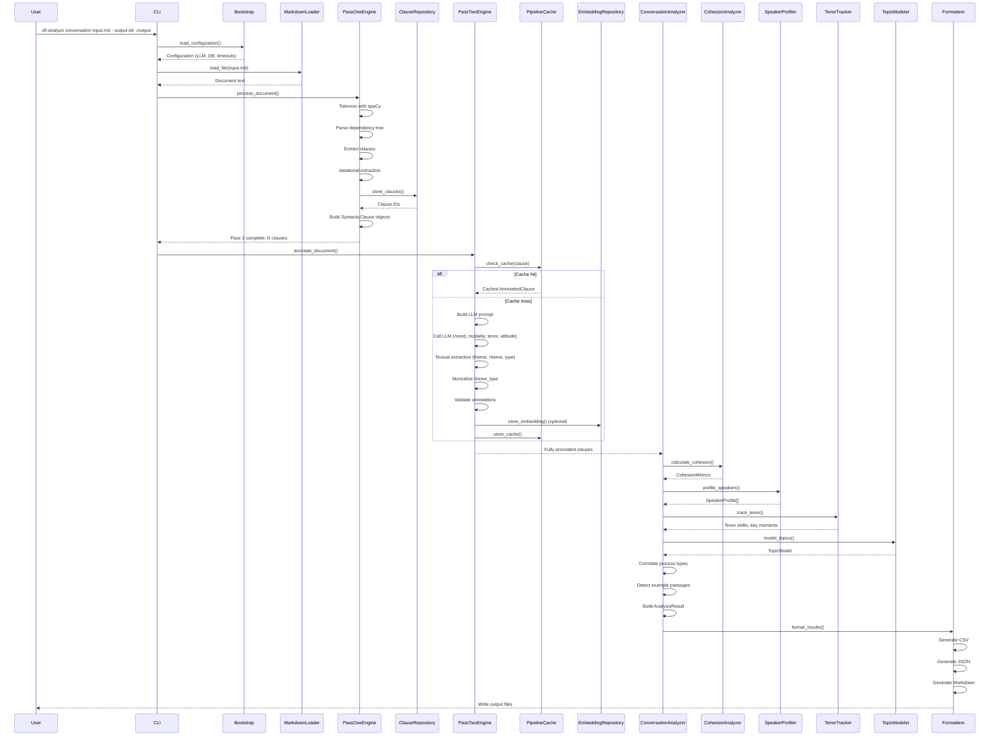
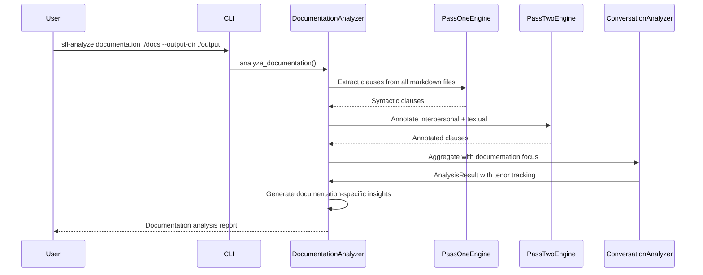
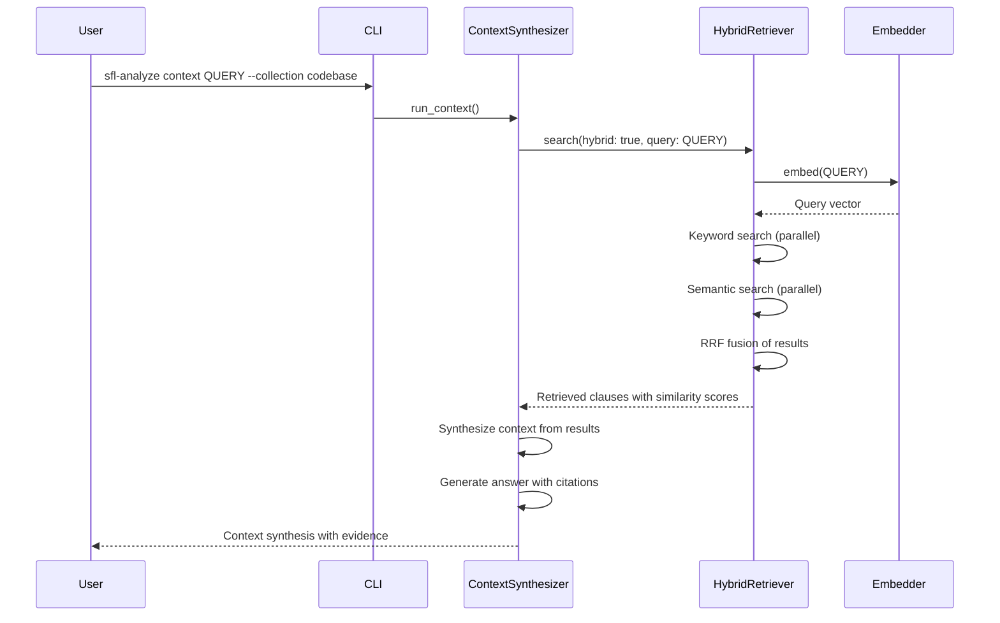
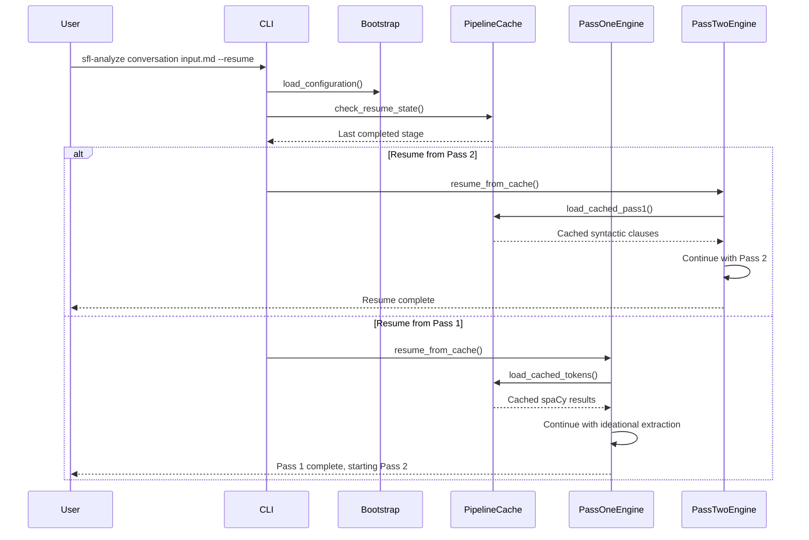
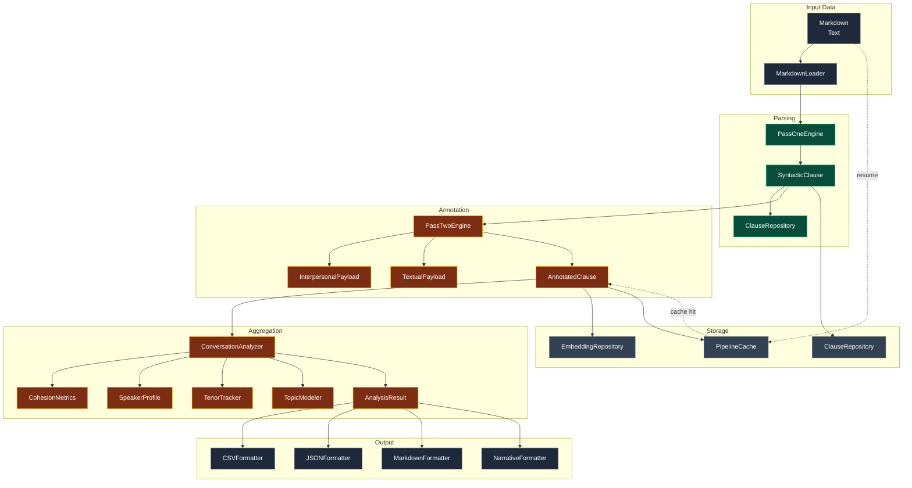
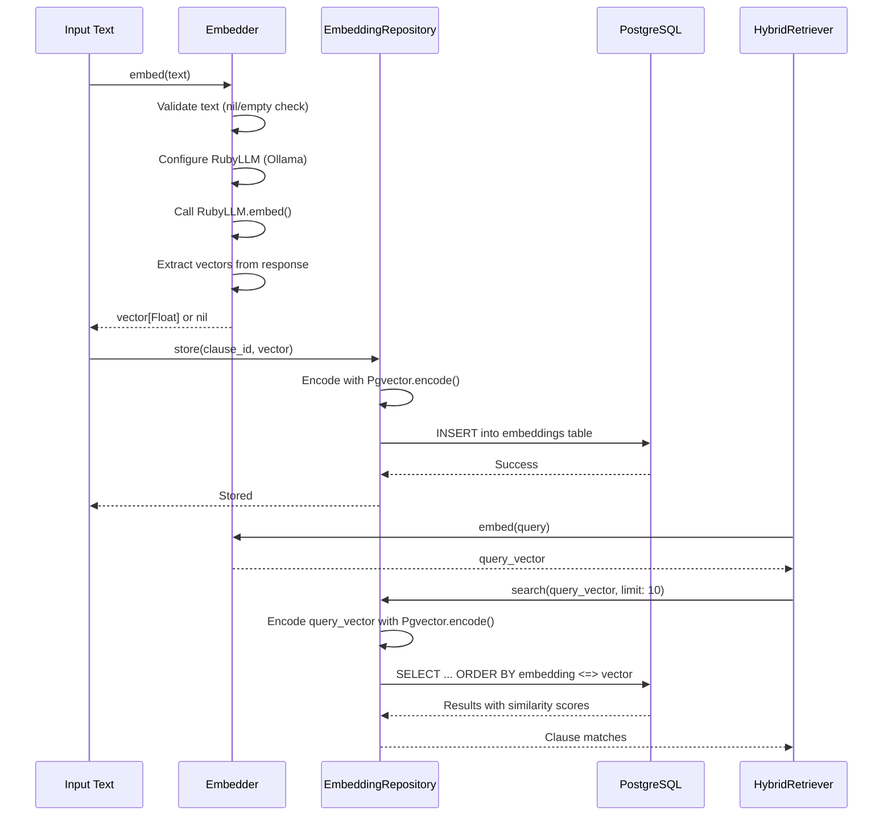

# Data Flow

The sfl-compiler data flow **prioritizes** deterministic transformation of text through well-defined stages **while** accommodating the non-deterministic nature of LLM annotations through caching and validation.

---

## Primary Operation: Conversation Analysis Pipeline



**Transformation Pipeline**:
1. **[Input Stage]**: MarkdownLoader **provides** document text **at** CLI invocation **through** file loading **for** downstream parsing
2. **[Validation Stage]**: Bootstrap **verifies** LLM and database configuration **producing** validated Configuration **or** clear error messages
3. **[Pass 1 Processing]**: PassOneEngine **transforms** raw text **into** syntactic clauses with IdeationalPayload **using** spaCy dependency parsing **generating** 1-N clauses per sentence
4. **[Pass 1 Storage]**: ClauseRepository **persists** syntactic clauses **as** PostgreSQL records **with** document_id, sentence_index, tokens, dependencies **enabling** resume and retrieval
5. **[Pass 2 Cache Check]**: PipelineCache **checks** for existing annotations **using** deterministic cache key (document_id + sentence_index + clause_text) **returning** cached results **if** available
6. **[Pass 2 Annotation]**: PassTwoEngine **transforms** syntactic clauses **into** AnnotatedClause **using** LLM prompts **producing** InterpersonalPayload + TextualPayload **with** circuit breaker protection
7. **[Pass 2 Storage]**: EmbeddingRepository **stores** vector embeddings **as** pgvector-encoded arrays **with** model identifier **enabling** semantic retrieval
8. **[Aggregation Stage]**: ConversationAnalyzer **aggregates** annotated clauses **into** turn-level metrics **including** CohesionMetrics (repetition_score, conjunction_density, pronoun_density), SpeakerProfile, KeyMoment[], ExamplePassage[]
9. **[Output Stage]**: Formatters **serialize** AnalysisResult **as** CSV (for spreadsheet analysis), JSON (for programmatic access), Markdown (for human reading) **with** data quality sections

---

## Secondary Flows

### Documentation Analysis Flow



**Critical Path**: DocumentationAnalyzer **coordinates** multi-file processing **enabling** corpus-wide linguistic analysis.

---

### Context Synthesis Flow



**Critical Path**: HybridRetriever **combines** keyword and semantic search **using** Reciprocal Rank Fusion **to produce** comprehensive retrieval results.

---

### Resume Flow (After Failure)



**Critical Path**: PipelineCache **enables** resume from exact failure point **by** storing intermediate results **with** deterministic cache keys.

---

## Data Model Flow



---

## Critical Paths

| Path | Data Journey | Enables | Confidence |
|------|--------------|---------|------------|
| **Business Critical** | Markdown → Pass1 → Pass2 → Analysis → Markdown report | Core linguistic analysis for users | EXTRACTED |
| **Performance Critical** | Clause → Embedding → Vector Storage → Semantic Retrieval | Efficient similar-clause finding | EXTRACTED |
| **Resilience Critical** | Pass2 partial failure → Cache → Resume | Recovery from LLM timeouts | EXTRACTED |
| **Quality Critical** | AnnotatedClause → Validation → Normalization | Consistent theme_type values | EXTRACTED |
| **Fallback Critical** | pgvector unavailable → Keyword-only retrieval | Graceful degradation | INFERRED |

---

## Embedding Data Flow



**Transformation Contract**:
Embedder **transforms** text strings **into** 768-dimensional float vectors **through** Ollama's embeddinggemma model **when** text is non-empty and Ollama is accessible.

---

## Pipeline Cache Data Flow

```mermaid
flowchart TD
    subgraph "Cache Key Generation"
        DI[document_id] --> CONCAT(( ))
        SI[sentence_index] --> CONCAT
        CT[clause_text] --> CONCAT
        CONCAT --> SHA256[SHA256 hash]
    end
    
    subgraph "Cache Operations"
        SHA256 --> PATH[cache_path]
        PATH --> EXISTS{exists?}
        EXISTS -->|yes| LOAD[Load JSON]
        EXISTS -->|no| SAVE[Save JSON]
        LOAD --> RECONSTRUCT[Reconstruct objects]
        RECONSTRUCT --> RETURN[Return cached]
        SAVE --> STORE[Store to disk]
    end
    
    classDef process fill:#0f172a,stroke:#38bdf8,color:#e0f2fe
    classDef decision fill:#7c2d12,stroke:#f59e0b,color:#fef3c7
    classDef action fill:#064e3b,stroke:#10b981,color:#d1fae5
    
    class DI,SI,CT CONCAT process
    class EXISTS decision
    class LOAD,SAVE,RECONSTRUCT,RETURN,STORE action
```

**Transformation Contract**:
PipelineCache **transforms** in-memory AnnotatedClause objects **into** JSON files on disk **keyed by** SHA256(document_id + sentence_index + clause_text) **enabling** deterministic cache lookups and resume capability.

---

## Ruby Pragmatist Data Flow Insight

The sfl-compiler data flow works like a **conveyor belt with quality checkpoints** — it **moves text through precisely calibrated stations (syntax parsing, semantic annotation, aggregation) where each stage adds value and stamps its quality mark**, much like a modern manufacturing line, **while the LLM stations occasionally need recalibration and the belt can remember where it left off thanks to the caching notebook**, ensuring that even if the line stops, production can resume without losing work.
