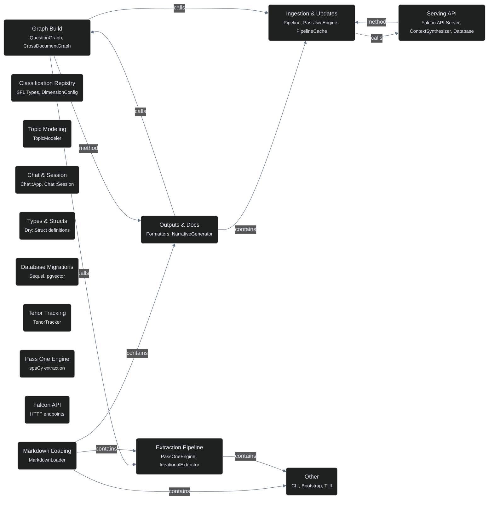

# Codebase Diagrams

_Mermaid diagrams for architecture visualization and code navigation._

---

## Architecture

High-level module relationships extracted from the codebase graph.

---

## Callflow Diagrams

Detailed call graphs for major subsystems.

| Diagram | Focus Area | Key Components |
|---------|------------|----------------|
| **callflow_1** | Extraction Pipeline | ThemeRhemeExtractor, IdeationalExtractor, Bootstrap |
| **callflow_2** | Graph Build | ConversationAnalyzer, QuestionGraph |
| **callflow_3** | Outputs & Docs | Formatters, NarrativeGenerator |
| **callflow_4** | Ingestion & Updates | Pipeline, PassTwoEngine, PipelineCache |
| **callflow_5** | Serving API | Falcon API Server, ContextSynthesizer, Database (fiber-safe pool) |
| **callflow_6** | Classification Registry | SFL Types, DimensionConfig |
| **callflow_7** | Topic Modeling | TopicModeler |
| **callflow_8** | Chat & Session | Chat::App, Chat::Session |
| **callflow_9** | Types & Structs | Dry::Struct definitions |
| **callflow_10** | Database Migrations | Sequel, pgvector |
| **callflow_11** | Tenor Tracking | TenorTracker |
| **callflow_12** | Pass One Engine | spaCy extraction |
| **callflow_13** | Falcon API | HTTP endpoints |
| **callflow_14** | Markdown Loading | MarkdownLoader |
| **callflow_15** | Other | CLI, Bootstrap, TUI |

---

## Legend

| Class | Color | Meaning |
|-------|-------|---------|
| `entry` | Yellow | Entry points (CLI, main) |
| `api` | Red | API endpoints |
| `async` | Purple | Async/background jobs |
| `klass` | Green | Core classes |
| `ui` | Pink | UI components |
| `module` | Blue | Module boundaries |
| `test` | Gray | Test files |
| `concept` | Dashed | Conceptual groupings |
| `function` | Cyan | Functions/methods |

---

## Graph Statistics

- **Nodes**: 915
- **Edges**: 1,246 (after removing low-confidence inferred edges)
- **Communities**: 64
- **Edge types**: All EXTRACTED (no INFERRED noise)

Stats above are from the last full semantic extraction. `callflow_5.mmd`
(Serving API) additionally carries a manually-added `ContextSynthesizer` +
`Database` subgraph (2026-07-03), sourced directly from a real
`graphify --update` run's `graph.json` — not fabricated — but not folded
back into the aggregate counts above, since that would require a full
re-extraction (semantic subagents across the whole corpus) rather than
the incremental, code-only AST update actually run. Run a full
`/graphify` pass to refresh these numbers precisely.
