# Codebase Diagrams

_Auto-extracted from graphify callflow output._

## Architecture

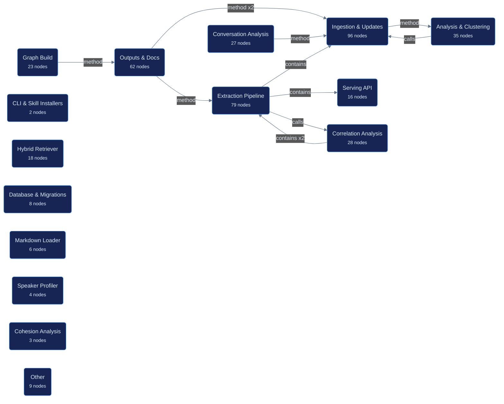

## Callflow 1

```mermaid
%%{init: {"theme": "dark", "themeVariables": {"fontSize": "15.0px", "fontFamily": "Segoe UI, system-ui, sans-serif", "primaryColor": "#1e293b", "primaryTextColor": "#e2e8f0", "primaryBorderColor": "#38bdf8", "secondaryColor": "#0f172a", "tertiaryColor": "#334155", "lineColor": "#64748b", "textColor": "#e2e8f0"}, "flowchart": {"htmlLabels": true, "curve": "basis", "nodeSpacing": 48, "rankSpacing": 64, "padding": 14, "diagramPadding": 10, "useMaxWidth": true}}}%%
flowchart LR
    %% Section: Extraction Pipeline (79 nodes, 104 edges)
    subgraph extract_pipeline_compiler_llm_tools_theme_rheme_6a5fca88["compiler/llm_tools/theme_rheme_extractor.rb"]
        llm_tools_theme_rheme_extractor_themerhemeextrac_e030c4d3("ThemeRhemeExtractor<br/><small>compiler/llm_tools/theme_rheme_extractor.rb</small>")
        llm_tools_theme_rheme_extractor_themerhemeextrac_f230448e("build_sfl_prompt()<br/><small>compiler/llm_tools/theme_rheme_extractor.rb</small>")
        llm_tools_theme_rheme_extractor_themerhemeextrac_94e13851("call_llm()<br/><small>compiler/llm_tools/theme_rheme_extractor.rb</small>")
        llm_tools_theme_rheme_extractor_themerhemeextrac_6c9be6f8("execute()<br/><small>compiler/llm_tools/theme_rheme_extractor.rb</small>")
        llm_tools_theme_rheme_extractor_themerhemeextrac_6ffa85dc("parse_theme_rheme_response()<br/><small>compiler/llm_tools/theme_rheme_extractor.rb</small>")
    end
    subgraph extract_pipeline_compiler_pass_one_ideational_ex_2ca7f799["compiler/pass_one/ideational_extractor.rb"]
        pass_one_ideational_extractor_ideationalextracto_41fbfcca("IdeationalExtractor<br/><small>compiler/pass_one/ideational_extractor.rb</small>")
        pass_one_ideational_extractor_ideationalextracto_c9d244ba("extract()<br/><small>compiler/pass_one/ideational_extractor.rb</small>")
        pass_one_ideational_extractor_ideationalextracto_fba12c3a("behavioral_verb?()<br/><small>compiler/pass_one/ideational_extractor.rb</small>")
        pass_one_ideational_extractor_ideationalextracto_55363a1f("build_transitivity_hash()<br/><small>compiler/pass_one/ideational_extractor.rb</small>")
        pass_one_ideational_extractor_ideationalextracto_601cafa7("classify_process()<br/><small>compiler/pass_one/ideational_extractor.rb</small>")
    end
    subgraph extract_pipeline_sfl_compiler_bootstrap_rb_e74b4ee5["sfl/compiler/bootstrap.rb"]
        compiler_bootstrap_call_137fcbed("call()<br/><small>sfl/compiler/bootstrap.rb</small>")
        compiler_bootstrap_configure_llm_d28028e1("configure_llm()<br/><small>sfl/compiler/bootstrap.rb</small>")
        compiler_bootstrap_connect_db_01db0cda("connect_db()<br/><small>sfl/compiler/bootstrap.rb</small>")
        compiler_bootstrap_api_key_for_9cf7eece("api_key_for()<br/><small>sfl/compiler/bootstrap.rb</small>")
        compiler_bootstrap_apply_request_timeout_6cee0ce4("apply_request_timeout()<br/><small>sfl/compiler/bootstrap.rb</small>")
    end
    pass_two_pass_two_engine_sflannotator_728897c4("SFLAnnotator<br/><small>compiler/pass_two/pass_two_engine.rb</small>")
    storage_clause_repository_clauserepository_362861bc("ClauseRepository<br/><small>compiler/storage/clause_repository.rb</small>")
    storage_database_migrator_ab243aa2("Migrator<br/><small>compiler/storage/database.rb</small>")
    compiler_bootstrap_call_137fcbed -->|calls| compiler_bootstrap_configure_llm_d28028e1
    compiler_bootstrap_call_137fcbed -->|calls| compiler_bootstrap_connect_db_01db0cda
    compiler_bootstrap_configure_llm_d28028e1 -->|calls| compiler_bootstrap_api_key_for_9cf7eece
    compiler_bootstrap_configure_llm_d28028e1 -->|calls| compiler_bootstrap_apply_request_timeout_6cee0ce4
    llm_tools_theme_rheme_extractor_themerhemeextrac_e030c4d3 -->|method| llm_tools_theme_rheme_extractor_themerhemeextrac_f230448e
    llm_tools_theme_rheme_extractor_themerhemeextrac_e030c4d3 -->|method| llm_tools_theme_rheme_extractor_themerhemeextrac_94e13851
    llm_tools_theme_rheme_extractor_themerhemeextrac_e030c4d3 -->|method| llm_tools_theme_rheme_extractor_themerhemeextrac_6c9be6f8
    llm_tools_theme_rheme_extractor_themerhemeextrac_e030c4d3 -->|method| llm_tools_theme_rheme_extractor_themerhemeextrac_6ffa85dc
    llm_tools_theme_rheme_extractor_themerhemeextrac_6c9be6f8 -->|calls| llm_tools_theme_rheme_extractor_themerhemeextrac_f230448e
    llm_tools_theme_rheme_extractor_themerhemeextrac_6c9be6f8 -->|calls| llm_tools_theme_rheme_extractor_themerhemeextrac_94e13851
    llm_tools_theme_rheme_extractor_themerhemeextrac_6c9be6f8 -->|calls| llm_tools_theme_rheme_extractor_themerhemeextrac_6ffa85dc
    pass_one_ideational_extractor_ideationalextracto_41fbfcca -->|method| pass_one_ideational_extractor_ideationalextracto_fba12c3a
    pass_one_ideational_extractor_ideationalextracto_41fbfcca -->|method| pass_one_ideational_extractor_ideationalextracto_55363a1f
    pass_one_ideational_extractor_ideationalextracto_41fbfcca -->|method| pass_one_ideational_extractor_ideationalextracto_601cafa7
    pass_one_ideational_extractor_ideationalextracto_41fbfcca -->|method| pass_one_ideational_extractor_ideationalextracto_c9d244ba
    pass_one_ideational_extractor_ideationalextracto_c9d244ba -->|calls| pass_one_ideational_extractor_ideationalextracto_55363a1f
    pass_one_ideational_extractor_ideationalextracto_c9d244ba -->|calls| pass_one_ideational_extractor_ideationalextracto_601cafa7
    pass_one_ideational_extractor_ideationalextracto_601cafa7 -->|calls| pass_one_ideational_extractor_ideationalextracto_fba12c3a
    %% Omitted for readability: 61 nodes, 0 edges
    class llm_tools_theme_rheme_extractor_themerhemeextrac_e030c4d3 klass;
    class llm_tools_theme_rheme_extractor_themerhemeextrac_f230448e function;
    class llm_tools_theme_rheme_extractor_themerhemeextrac_94e13851 function;
    class llm_tools_theme_rheme_extractor_themerhemeextrac_6c9be6f8 function;
    class llm_tools_theme_rheme_extractor_themerhemeextrac_6ffa85dc function;
    class pass_one_ideational_extractor_ideationalextracto_41fbfcca klass;
    class pass_one_ideational_extractor_ideationalextracto_c9d244ba function;
    class pass_one_ideational_extractor_ideationalextracto_fba12c3a function;
    class pass_one_ideational_extractor_ideationalextracto_55363a1f function;
    class pass_one_ideational_extractor_ideationalextracto_601cafa7 function;
    class compiler_bootstrap_call_137fcbed function;
    class compiler_bootstrap_configure_llm_d28028e1 function;
    class compiler_bootstrap_connect_db_01db0cda function;
    class compiler_bootstrap_api_key_for_9cf7eece api;
    class compiler_bootstrap_apply_request_timeout_6cee0ce4 function;
    class pass_two_pass_two_engine_sflannotator_728897c4 klass;
    class storage_clause_repository_clauserepository_362861bc klass;
    class storage_database_migrator_ab243aa2 klass;
    classDef entry fill:#422006,stroke:#fbbf24,color:#fde68a,stroke-width:1px;
    classDef api fill:#450a0a,stroke:#f87171,color:#fee2e2,stroke-width:1px;
    classDef async fill:#2e1065,stroke:#a78bfa,color:#ede9fe,stroke-width:1px;
    classDef klass fill:#064e3b,stroke:#34d399,color:#d1fae5,stroke-width:1px;
    classDef ui fill:#831843,stroke:#f472b6,color:#fce7f3,stroke-width:1px;
    classDef module fill:#172554,stroke:#60a5fa,color:#dbeafe,stroke-width:1px;
    classDef test fill:#3f3f46,stroke:#a1a1aa,color:#f4f4f5,stroke-width:1px;
    classDef concept fill:#292524,stroke:#a8a29e,color:#fafaf9,stroke-dasharray:4 3;
    classDef function fill:#0f172a,stroke:#38bdf8,color:#e0f2fe,stroke-width:1px;
```

## Callflow 2

```mermaid
%%{init: {"theme": "dark", "themeVariables": {"fontSize": "15.0px", "fontFamily": "Segoe UI, system-ui, sans-serif", "primaryColor": "#1e293b", "primaryTextColor": "#e2e8f0", "primaryBorderColor": "#38bdf8", "secondaryColor": "#0f172a", "tertiaryColor": "#334155", "lineColor": "#64748b", "textColor": "#e2e8f0"}, "flowchart": {"htmlLabels": true, "curve": "basis", "nodeSpacing": 48, "rankSpacing": 64, "padding": 14, "diagramPadding": 10, "useMaxWidth": true}}}%%
flowchart LR
    %% Section: Graph Build (23 nodes, 34 edges)
    subgraph build_graph_compiler_analysis_conversation_analy_517b4a8a["compiler/analysis/conversation_analyzer.rb"]
        analysis_conversation_analyzer_conversationanaly_22cc21a4("ConversationAnalyzer<br/><small>compiler/analysis/conversation_analyzer.rb</small>")
        analysis_conversation_analyzer_conversationanaly_11a87abc("analyze()<br/><small>compiler/analysis/conversation_analyzer.rb</small>")
        analysis_conversation_analyzer_conversationanaly_51faa16e("compile_turn()<br/><small>compiler/analysis/conversation_analyzer.rb</small>")
        analysis_conversation_analyzer_conversationanaly_8c9e44a2("compile_clauses()<br/><small>compiler/analysis/conversation_analyzer.rb</small>")
        analysis_conversation_analyzer_conversationanaly_7da27936("detect_example_passages()<br/><small>compiler/analysis/conversation_analyzer.rb</small>")
        analysis_conversation_analyzer_conversationanaly_cc598ed8("detect_key_moments()<br/><small>compiler/analysis/conversation_analyzer.rb</small>")
        analysis_conversation_analyzer_conversationanaly_08944a90("field_evolution()<br/><small>compiler/analysis/conversation_analyzer.rb</small>")
        analysis_conversation_analyzer_conversationanaly_b28b8629("generate_insights()<br/><small>compiler/analysis/conversation_analyzer.rb</small>")
        analysis_conversation_analyzer_conversationanaly_1f8808fa("load_jsonl()<br/><small>compiler/analysis/conversation_analyzer.rb</small>")
        analysis_conversation_analyzer_conversationanaly_2ca6ac64("mean()<br/><small>compiler/analysis/conversation_analyzer.rb</small>")
        analysis_conversation_analyzer_conversationanaly_8c73969d("parse_timestamp()<br/><small>compiler/analysis/conversation_analyzer.rb</small>")
        analysis_conversation_analyzer_conversationanaly_eafa79dc("report_progress()<br/><small>compiler/analysis/conversation_analyzer.rb</small>")
        analysis_conversation_analyzer_conversationanaly_049a3b17("tenor_timeline()<br/><small>compiler/analysis/conversation_analyzer.rb</small>")
        analysis_conversation_analyzer_conversationanaly_cce05129("topic_evolution()<br/><small>compiler/analysis/conversation_analyzer.rb</small>")
    end
    subgraph build_graph_compiler_formatters_json_formatter_r_91d3a391["compiler/formatters/json_formatter.rb"]
        formatters_json_formatter_jsonformatter_a9d3f8de("JSONFormatter<br/><small>compiler/formatters/json_formatter.rb</small>")
        formatters_json_formatter_jsonformatter_annotati_45808425("annotation_coverage()<br/><small>compiler/formatters/json_formatter.rb</small>")
        formatters_json_formatter_jsonformatter_build_ha_76b6e714("build_hash()<br/><small>compiler/formatters/json_formatter.rb</small>")
        formatters_json_formatter_jsonformatter_format_m_58768623("format_metadata()<br/><small>compiler/formatters/json_formatter.rb</small>")
    end
    analysis_conversation_analyzer_conversationanaly_22cc21a4 -->|method| analysis_conversation_analyzer_conversationanaly_11a87abc
    analysis_conversation_analyzer_conversationanaly_22cc21a4 -->|method| analysis_conversation_analyzer_conversationanaly_8c9e44a2
    analysis_conversation_analyzer_conversationanaly_22cc21a4 -->|method| analysis_conversation_analyzer_conversationanaly_51faa16e
    analysis_conversation_analyzer_conversationanaly_22cc21a4 -->|method| analysis_conversation_analyzer_conversationanaly_7da27936
    analysis_conversation_analyzer_conversationanaly_22cc21a4 -->|method| analysis_conversation_analyzer_conversationanaly_cc598ed8
    analysis_conversation_analyzer_conversationanaly_22cc21a4 -->|method| analysis_conversation_analyzer_conversationanaly_08944a90
    analysis_conversation_analyzer_conversationanaly_22cc21a4 -->|method| analysis_conversation_analyzer_conversationanaly_b28b8629
    analysis_conversation_analyzer_conversationanaly_22cc21a4 -->|method| analysis_conversation_analyzer_conversationanaly_1f8808fa
    analysis_conversation_analyzer_conversationanaly_22cc21a4 -->|method| analysis_conversation_analyzer_conversationanaly_2ca6ac64
    analysis_conversation_analyzer_conversationanaly_22cc21a4 -->|method| analysis_conversation_analyzer_conversationanaly_8c73969d
    analysis_conversation_analyzer_conversationanaly_22cc21a4 -->|method| analysis_conversation_analyzer_conversationanaly_eafa79dc
    analysis_conversation_analyzer_conversationanaly_22cc21a4 -->|method| analysis_conversation_analyzer_conversationanaly_049a3b17
    analysis_conversation_analyzer_conversationanaly_22cc21a4 -->|method| analysis_conversation_analyzer_conversationanaly_cce05129
    analysis_conversation_analyzer_conversationanaly_11a87abc -->|calls| analysis_conversation_analyzer_conversationanaly_51faa16e
    analysis_conversation_analyzer_conversationanaly_11a87abc -->|calls| analysis_conversation_analyzer_conversationanaly_7da27936
    analysis_conversation_analyzer_conversationanaly_11a87abc -->|calls| analysis_conversation_analyzer_conversationanaly_cc598ed8
    analysis_conversation_analyzer_conversationanaly_11a87abc -->|calls| analysis_conversation_analyzer_conversationanaly_08944a90
    analysis_conversation_analyzer_conversationanaly_11a87abc -->|calls| analysis_conversation_analyzer_conversationanaly_b28b8629
    analysis_conversation_analyzer_conversationanaly_11a87abc -->|calls| analysis_conversation_analyzer_conversationanaly_1f8808fa
    analysis_conversation_analyzer_conversationanaly_11a87abc -->|calls| analysis_conversation_analyzer_conversationanaly_eafa79dc
    analysis_conversation_analyzer_conversationanaly_11a87abc -->|calls| analysis_conversation_analyzer_conversationanaly_049a3b17
    analysis_conversation_analyzer_conversationanaly_11a87abc -->|calls| analysis_conversation_analyzer_conversationanaly_cce05129
    analysis_conversation_analyzer_conversationanaly_51faa16e -->|calls| analysis_conversation_analyzer_conversationanaly_8c9e44a2
    analysis_conversation_analyzer_conversationanaly_51faa16e -->|calls| analysis_conversation_analyzer_conversationanaly_2ca6ac64
    %% Omitted for readability: 5 nodes, 4 edges
    class analysis_conversation_analyzer_conversationanaly_22cc21a4 klass;
    class analysis_conversation_analyzer_conversationanaly_11a87abc function;
    class analysis_conversation_analyzer_conversationanaly_51faa16e function;
    class analysis_conversation_analyzer_conversationanaly_8c9e44a2 function;
    class analysis_conversation_analyzer_conversationanaly_7da27936 function;
    class analysis_conversation_analyzer_conversationanaly_cc598ed8 function;
    class analysis_conversation_analyzer_conversationanaly_08944a90 function;
    class analysis_conversation_analyzer_conversationanaly_b28b8629 function;
    class analysis_conversation_analyzer_conversationanaly_1f8808fa function;
    class analysis_conversation_analyzer_conversationanaly_2ca6ac64 function;
    class analysis_conversation_analyzer_conversationanaly_8c73969d function;
    class analysis_conversation_analyzer_conversationanaly_eafa79dc function;
    class analysis_conversation_analyzer_conversationanaly_049a3b17 function;
    class analysis_conversation_analyzer_conversationanaly_cce05129 function;
    class formatters_json_formatter_jsonformatter_a9d3f8de klass;
    class formatters_json_formatter_jsonformatter_annotati_45808425 function;
    class formatters_json_formatter_jsonformatter_build_ha_76b6e714 function;
    class formatters_json_formatter_jsonformatter_format_m_58768623 function;
    classDef entry fill:#422006,stroke:#fbbf24,color:#fde68a,stroke-width:1px;
    classDef api fill:#450a0a,stroke:#f87171,color:#fee2e2,stroke-width:1px;
    classDef async fill:#2e1065,stroke:#a78bfa,color:#ede9fe,stroke-width:1px;
    classDef klass fill:#064e3b,stroke:#34d399,color:#d1fae5,stroke-width:1px;
    classDef ui fill:#831843,stroke:#f472b6,color:#fce7f3,stroke-width:1px;
    classDef module fill:#172554,stroke:#60a5fa,color:#dbeafe,stroke-width:1px;
    classDef test fill:#3f3f46,stroke:#a1a1aa,color:#f4f4f5,stroke-width:1px;
    classDef concept fill:#292524,stroke:#a8a29e,color:#fafaf9,stroke-dasharray:4 3;
    classDef function fill:#0f172a,stroke:#38bdf8,color:#e0f2fe,stroke-width:1px;
```

## Callflow 3

```mermaid
%%{init: {"theme": "dark", "themeVariables": {"fontSize": "15.0px", "fontFamily": "Segoe UI, system-ui, sans-serif", "primaryColor": "#1e293b", "primaryTextColor": "#e2e8f0", "primaryBorderColor": "#38bdf8", "secondaryColor": "#0f172a", "tertiaryColor": "#334155", "lineColor": "#64748b", "textColor": "#e2e8f0"}, "flowchart": {"htmlLabels": true, "curve": "basis", "nodeSpacing": 48, "rankSpacing": 64, "padding": 14, "diagramPadding": 10, "useMaxWidth": true}}}%%
flowchart LR
    %% Section: Analysis & Clustering (35 nodes, 45 edges)
    subgraph analysis_clustering_compiler_analysis_speaker_pr_ea09ffe8["compiler/analysis/speaker_profiler.rb"]
        analysis_speaker_profiler_speakerprofiler_f8dbb0c2("SpeakerProfiler<br/><small>compiler/analysis/speaker_profiler.rb</small>")
        analysis_speaker_profiler_speakerprofiler_build_65a31526("build_profile()<br/><small>compiler/analysis/speaker_profiler.rb</small>")
        analysis_speaker_profiler_speakerprofiler_aggreg_49516921("aggregate_process_types()<br/><small>compiler/analysis/speaker_profiler.rb</small>")
        analysis_speaker_profiler_speakerprofiler_build_d489d1c2("build_profiles()<br/><small>compiler/analysis/speaker_profiler.rb</small>")
        analysis_speaker_profiler_speakerprofiler_calcul_35874cf7("calculate_mood_distribution()<br/><small>compiler/analysis/speaker_profiler.rb</small>")
        analysis_speaker_profiler_speakerprofiler_initia_4e55b369("initialize()<br/><small>compiler/analysis/speaker_profiler.rb</small>")
        analysis_speaker_profiler_speakerprofiler_mean_d08818b7("mean()<br/><small>compiler/analysis/speaker_profiler.rb</small>")
    end
    subgraph analysis_clustering_compiler_analysis_cohesion_a_7a915b48["compiler/analysis/cohesion_analyzer.rb"]
        analysis_cohesion_analyzer_cohesionanalyzer_70dd4798("CohesionAnalyzer<br/><small>compiler/analysis/cohesion_analyzer.rb</small>")
        analysis_cohesion_analyzer_cohesionanalyzer_calc_5f89f707("calculate_metrics()<br/><small>compiler/analysis/cohesion_analyzer.rb</small>")
        analysis_cohesion_analyzer_cohesionanalyzer_anal_39b06f66("analyze()<br/><small>compiler/analysis/cohesion_analyzer.rb</small>")
        analysis_cohesion_analyzer_cohesionanalyzer_calc_f6915252("calculate_density()<br/><small>compiler/analysis/cohesion_analyzer.rb</small>")
        analysis_cohesion_analyzer_cohesionanalyzer_calc_288eebb1("calculate_repetition()<br/><small>compiler/analysis/cohesion_analyzer.rb</small>")
        analysis_cohesion_analyzer_cohesionanalyzer_defa_01100d60("default_metrics()<br/><small>compiler/analysis/cohesion_analyzer.rb</small>")
    end
    subgraph analysis_clustering_compiler_analysis_correlatio_de428fc3["compiler/analysis/correlation_analyzer.rb"]
        analysis_correlation_analyzer_correlationanalyze_42517e87("CorrelationAnalyzer<br/><small>compiler/analysis/correlation_analyzer.rb</small>")
        analysis_correlation_analyzer_correlationanalyze_71ba14d5("correlate_process_tenor()<br/><small>compiler/analysis/correlation_analyzer.rb</small>")
        analysis_correlation_analyzer_correlationanalyze_a8a69b71("initialize()<br/><small>compiler/analysis/correlation_analyzer.rb</small>")
        analysis_correlation_analyzer_correlationanalyze_ffde35ac("mean()<br/><small>compiler/analysis/correlation_analyzer.rb</small>")
    end
    query_20260613_032646_parse_6dcec26c("parse()<br/><small>graphify-out/memory/query_20260613_032646_why_does_parse_connect_conversation_analysis_to_co.md</small>")
    analysis_cohesion_analyzer_cohesionanalyzer_70dd4798 -->|method| analysis_cohesion_analyzer_cohesionanalyzer_anal_39b06f66
    analysis_cohesion_analyzer_cohesionanalyzer_70dd4798 -->|method| analysis_cohesion_analyzer_cohesionanalyzer_calc_f6915252
    analysis_cohesion_analyzer_cohesionanalyzer_70dd4798 -->|method| analysis_cohesion_analyzer_cohesionanalyzer_calc_5f89f707
    analysis_cohesion_analyzer_cohesionanalyzer_70dd4798 -->|method| analysis_cohesion_analyzer_cohesionanalyzer_calc_288eebb1
    analysis_cohesion_analyzer_cohesionanalyzer_70dd4798 -->|method| analysis_cohesion_analyzer_cohesionanalyzer_defa_01100d60
    analysis_cohesion_analyzer_cohesionanalyzer_anal_39b06f66 -->|calls| analysis_cohesion_analyzer_cohesionanalyzer_calc_5f89f707
    analysis_cohesion_analyzer_cohesionanalyzer_calc_5f89f707 -->|calls| analysis_cohesion_analyzer_cohesionanalyzer_calc_f6915252
    analysis_cohesion_analyzer_cohesionanalyzer_calc_5f89f707 -->|calls| analysis_cohesion_analyzer_cohesionanalyzer_calc_288eebb1
    analysis_correlation_analyzer_correlationanalyze_42517e87 -->|method| analysis_correlation_analyzer_correlationanalyze_71ba14d5
    analysis_correlation_analyzer_correlationanalyze_42517e87 -->|method| analysis_correlation_analyzer_correlationanalyze_a8a69b71
    analysis_correlation_analyzer_correlationanalyze_42517e87 -->|method| analysis_correlation_analyzer_correlationanalyze_ffde35ac
    analysis_correlation_analyzer_correlationanalyze_71ba14d5 -->|calls| analysis_correlation_analyzer_correlationanalyze_ffde35ac
    analysis_speaker_profiler_speakerprofiler_f8dbb0c2 -->|method| analysis_speaker_profiler_speakerprofiler_aggreg_49516921
    analysis_speaker_profiler_speakerprofiler_f8dbb0c2 -->|method| analysis_speaker_profiler_speakerprofiler_build_65a31526
    analysis_speaker_profiler_speakerprofiler_f8dbb0c2 -->|method| analysis_speaker_profiler_speakerprofiler_build_d489d1c2
    analysis_speaker_profiler_speakerprofiler_f8dbb0c2 -->|method| analysis_speaker_profiler_speakerprofiler_calcul_35874cf7
    analysis_speaker_profiler_speakerprofiler_f8dbb0c2 -->|method| analysis_speaker_profiler_speakerprofiler_initia_4e55b369
    analysis_speaker_profiler_speakerprofiler_f8dbb0c2 -->|method| analysis_speaker_profiler_speakerprofiler_mean_d08818b7
    analysis_speaker_profiler_speakerprofiler_build_65a31526 -->|calls| analysis_speaker_profiler_speakerprofiler_mean_d08818b7
    analysis_speaker_profiler_speakerprofiler_build_65a31526 -->|calls| analysis_speaker_profiler_speakerprofiler_build_d489d1c2
    %% Omitted for readability: 17 nodes, 0 edges
    class analysis_speaker_profiler_speakerprofiler_f8dbb0c2 klass;
    class analysis_speaker_profiler_speakerprofiler_build_65a31526 function;
    class analysis_speaker_profiler_speakerprofiler_aggreg_49516921 function;
    class analysis_speaker_profiler_speakerprofiler_build_d489d1c2 function;
    class analysis_speaker_profiler_speakerprofiler_calcul_35874cf7 function;
    class analysis_speaker_profiler_speakerprofiler_initia_4e55b369 function;
    class analysis_speaker_profiler_speakerprofiler_mean_d08818b7 function;
    class analysis_cohesion_analyzer_cohesionanalyzer_70dd4798 klass;
    class analysis_cohesion_analyzer_cohesionanalyzer_calc_5f89f707 function;
    class analysis_cohesion_analyzer_cohesionanalyzer_anal_39b06f66 function;
    class analysis_cohesion_analyzer_cohesionanalyzer_calc_f6915252 function;
    class analysis_cohesion_analyzer_cohesionanalyzer_calc_288eebb1 function;
    class analysis_cohesion_analyzer_cohesionanalyzer_defa_01100d60 function;
    class analysis_correlation_analyzer_correlationanalyze_42517e87 klass;
    class analysis_correlation_analyzer_correlationanalyze_71ba14d5 function;
    class analysis_correlation_analyzer_correlationanalyze_a8a69b71 function;
    class analysis_correlation_analyzer_correlationanalyze_ffde35ac function;
    class query_20260613_032646_parse_6dcec26c function;
    classDef entry fill:#422006,stroke:#fbbf24,color:#fde68a,stroke-width:1px;
    classDef api fill:#450a0a,stroke:#f87171,color:#fee2e2,stroke-width:1px;
    classDef async fill:#2e1065,stroke:#a78bfa,color:#ede9fe,stroke-width:1px;
    classDef klass fill:#064e3b,stroke:#34d399,color:#d1fae5,stroke-width:1px;
    classDef ui fill:#831843,stroke:#f472b6,color:#fce7f3,stroke-width:1px;
    classDef module fill:#172554,stroke:#60a5fa,color:#dbeafe,stroke-width:1px;
    classDef test fill:#3f3f46,stroke:#a1a1aa,color:#f4f4f5,stroke-width:1px;
    classDef concept fill:#292524,stroke:#a8a29e,color:#fafaf9,stroke-dasharray:4 3;
    classDef function fill:#0f172a,stroke:#38bdf8,color:#e0f2fe,stroke-width:1px;
```

## Callflow 4

```mermaid
%%{init: {"theme": "dark", "themeVariables": {"fontSize": "15.0px", "fontFamily": "Segoe UI, system-ui, sans-serif", "primaryColor": "#1e293b", "primaryTextColor": "#e2e8f0", "primaryBorderColor": "#38bdf8", "secondaryColor": "#0f172a", "tertiaryColor": "#334155", "lineColor": "#64748b", "textColor": "#e2e8f0"}, "flowchart": {"htmlLabels": true, "curve": "basis", "nodeSpacing": 48, "rankSpacing": 64, "padding": 14, "diagramPadding": 10, "useMaxWidth": true}}}%%
flowchart LR
    %% Section: Outputs & Docs (62 nodes, 80 edges)
    subgraph outputs_docs_compiler_analysis_documentation_ana_e30e1b1d["compiler/analysis/documentation_analyzer.rb"]
        analysis_documentation_analyzer_documentationana_84138c61("DocumentationAnalyzer<br/><small>compiler/analysis/documentation_analyzer.rb</small>")
        analysis_documentation_analyzer_documentationana_238df06d("analyze()<br/><small>compiler/analysis/documentation_analyzer.rb</small>")
        analysis_documentation_analyzer_documentationana_c48446d1("compile_section()<br/><small>compiler/analysis/documentation_analyzer.rb</small>")
        analysis_documentation_analyzer_documentationana_5d78a700("detect_example_passages()<br/><small>compiler/analysis/documentation_analyzer.rb</small>")
        analysis_documentation_analyzer_documentationana_74662ff2("detect_key_moments()<br/><small>compiler/analysis/documentation_analyzer.rb</small>")
        analysis_documentation_analyzer_documentationana_ae1cbd8d("field_evolution()<br/><small>compiler/analysis/documentation_analyzer.rb</small>")
        analysis_documentation_analyzer_documentationana_cfd8516d("generate_topic_insights()<br/><small>compiler/analysis/documentation_analyzer.rb</small>")
        analysis_documentation_analyzer_documentationana_9ff4b5a3("initialize()<br/><small>compiler/analysis/documentation_analyzer.rb</small>")
        analysis_documentation_analyzer_documentationana_f1942732("load_sections()<br/><small>compiler/analysis/documentation_analyzer.rb</small>")
        analysis_documentation_analyzer_documentationana_617723f6("mean()<br/><small>compiler/analysis/documentation_analyzer.rb</small>")
        analysis_documentation_analyzer_documentationana_d6213cab("report_progress()<br/><small>compiler/analysis/documentation_analyzer.rb</small>")
        analysis_documentation_analyzer_documentationana_4d2a8c13("timeline()<br/><small>compiler/analysis/documentation_analyzer.rb</small>")
        analysis_documentation_analyzer_documentationana_4c02b29e("topic_evolution()<br/><small>compiler/analysis/documentation_analyzer.rb</small>")
    end
    subgraph outputs_docs_compiler_analysis_tenor_tracker_rb_96f412c5["compiler/analysis/tenor_tracker.rb"]
        analysis_tenor_tracker_tenortracker_bafc7015("TenorTracker<br/><small>compiler/analysis/tenor_tracker.rb</small>")
        analysis_tenor_tracker_tenortracker_calculate_sh_d216dd7b("calculate_shifts()<br/><small>compiler/analysis/tenor_tracker.rb</small>")
    end
    formatters_base_formatter_baseformatter_dc96c473("BaseFormatter<br/><small>compiler/formatters/base_formatter.rb</small>")
    pass_one_pass_one_engine_passoneengine_1967dc5f("PassOneEngine<br/><small>compiler/pass_one/pass_one_engine.rb</small>")
    compiler_pipeline_pipeline_554e7cf0("Pipeline<br/><small>sfl/compiler/pipeline.rb</small>")
    analysis_documentation_analyzer_documentationana_84138c61 -->|method| analysis_documentation_analyzer_documentationana_238df06d
    analysis_documentation_analyzer_documentationana_84138c61 -->|method| analysis_documentation_analyzer_documentationana_c48446d1
    analysis_documentation_analyzer_documentationana_84138c61 -->|method| analysis_documentation_analyzer_documentationana_5d78a700
    analysis_documentation_analyzer_documentationana_84138c61 -->|method| analysis_documentation_analyzer_documentationana_74662ff2
    analysis_documentation_analyzer_documentationana_84138c61 -->|method| analysis_documentation_analyzer_documentationana_ae1cbd8d
    analysis_documentation_analyzer_documentationana_84138c61 -->|method| analysis_documentation_analyzer_documentationana_cfd8516d
    analysis_documentation_analyzer_documentationana_84138c61 -->|method| analysis_documentation_analyzer_documentationana_9ff4b5a3
    analysis_documentation_analyzer_documentationana_84138c61 -->|method| analysis_documentation_analyzer_documentationana_f1942732
    analysis_documentation_analyzer_documentationana_84138c61 -->|method| analysis_documentation_analyzer_documentationana_617723f6
    analysis_documentation_analyzer_documentationana_84138c61 -->|method| analysis_documentation_analyzer_documentationana_d6213cab
    analysis_documentation_analyzer_documentationana_84138c61 -->|method| analysis_documentation_analyzer_documentationana_4d2a8c13
    analysis_documentation_analyzer_documentationana_84138c61 -->|method| analysis_documentation_analyzer_documentationana_4c02b29e
    analysis_documentation_analyzer_documentationana_238df06d -->|calls| analysis_documentation_analyzer_documentationana_c48446d1
    analysis_documentation_analyzer_documentationana_238df06d -->|calls| analysis_documentation_analyzer_documentationana_5d78a700
    analysis_documentation_analyzer_documentationana_238df06d -->|calls| analysis_documentation_analyzer_documentationana_74662ff2
    analysis_documentation_analyzer_documentationana_238df06d -->|calls| analysis_documentation_analyzer_documentationana_ae1cbd8d
    analysis_documentation_analyzer_documentationana_238df06d -->|calls| analysis_documentation_analyzer_documentationana_cfd8516d
    analysis_documentation_analyzer_documentationana_238df06d -->|calls| analysis_documentation_analyzer_documentationana_f1942732
    analysis_documentation_analyzer_documentationana_238df06d -->|calls| analysis_documentation_analyzer_documentationana_d6213cab
    analysis_documentation_analyzer_documentationana_238df06d -->|calls| analysis_documentation_analyzer_documentationana_4d2a8c13
    analysis_documentation_analyzer_documentationana_238df06d -->|calls| analysis_documentation_analyzer_documentationana_4c02b29e
    analysis_documentation_analyzer_documentationana_c48446d1 -->|calls| analysis_documentation_analyzer_documentationana_617723f6
    analysis_tenor_tracker_tenortracker_bafc7015 -->|method| analysis_tenor_tracker_tenortracker_calculate_sh_d216dd7b
    %% Omitted for readability: 44 nodes, 0 edges
    class analysis_documentation_analyzer_documentationana_84138c61 klass;
    class analysis_documentation_analyzer_documentationana_238df06d function;
    class analysis_documentation_analyzer_documentationana_c48446d1 function;
    class analysis_documentation_analyzer_documentationana_5d78a700 function;
    class analysis_documentation_analyzer_documentationana_74662ff2 function;
    class analysis_documentation_analyzer_documentationana_ae1cbd8d function;
    class analysis_documentation_analyzer_documentationana_cfd8516d function;
    class analysis_documentation_analyzer_documentationana_9ff4b5a3 function;
    class analysis_documentation_analyzer_documentationana_f1942732 function;
    class analysis_documentation_analyzer_documentationana_617723f6 function;
    class analysis_documentation_analyzer_documentationana_d6213cab function;
    class analysis_documentation_analyzer_documentationana_4d2a8c13 function;
    class analysis_documentation_analyzer_documentationana_4c02b29e function;
    class analysis_tenor_tracker_tenortracker_bafc7015 klass;
    class analysis_tenor_tracker_tenortracker_calculate_sh_d216dd7b function;
    class formatters_base_formatter_baseformatter_dc96c473 klass;
    class pass_one_pass_one_engine_passoneengine_1967dc5f klass;
    class compiler_pipeline_pipeline_554e7cf0 klass;
    classDef entry fill:#422006,stroke:#fbbf24,color:#fde68a,stroke-width:1px;
    classDef api fill:#450a0a,stroke:#f87171,color:#fee2e2,stroke-width:1px;
    classDef async fill:#2e1065,stroke:#a78bfa,color:#ede9fe,stroke-width:1px;
    classDef klass fill:#064e3b,stroke:#34d399,color:#d1fae5,stroke-width:1px;
    classDef ui fill:#831843,stroke:#f472b6,color:#fce7f3,stroke-width:1px;
    classDef module fill:#172554,stroke:#60a5fa,color:#dbeafe,stroke-width:1px;
    classDef test fill:#3f3f46,stroke:#a1a1aa,color:#f4f4f5,stroke-width:1px;
    classDef concept fill:#292524,stroke:#a8a29e,color:#fafaf9,stroke-dasharray:4 3;
    classDef function fill:#0f172a,stroke:#38bdf8,color:#e0f2fe,stroke-width:1px;
```

## Callflow 5

## Callflow 6

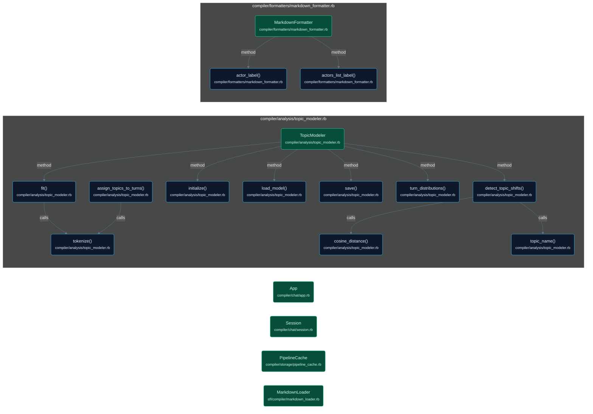

## Callflow 7

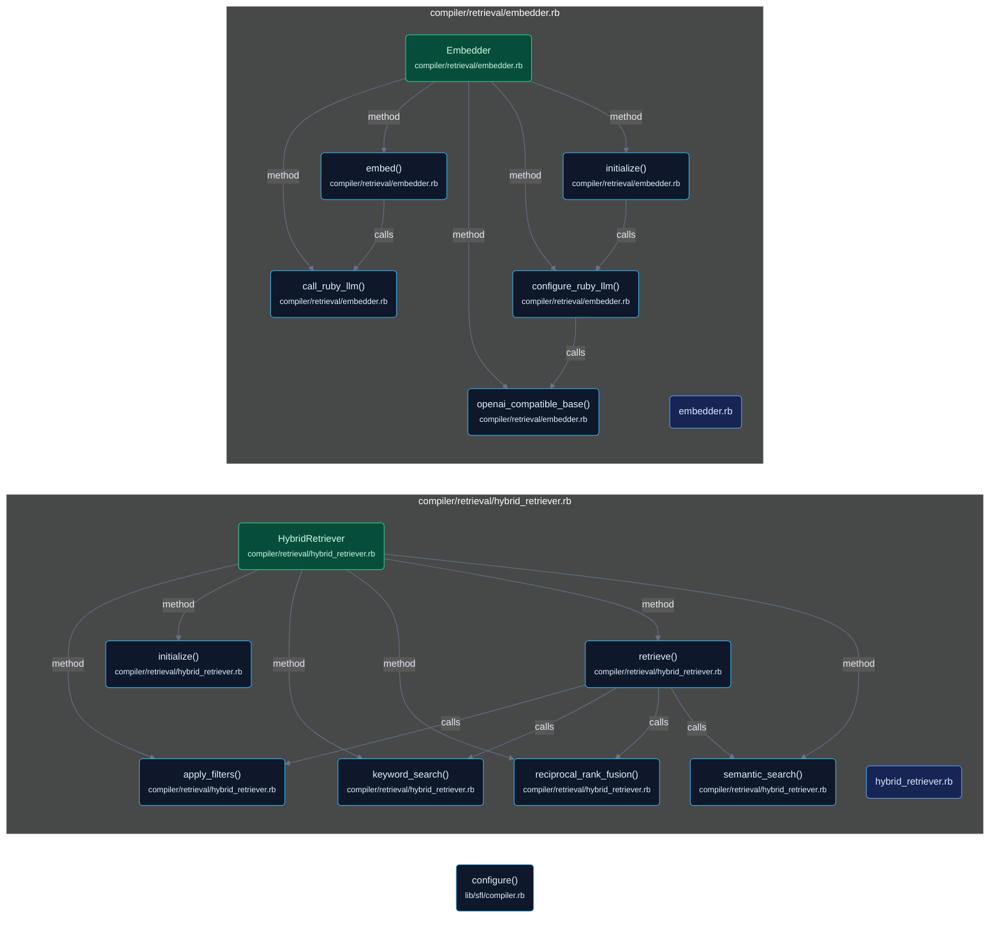

## Callflow 8

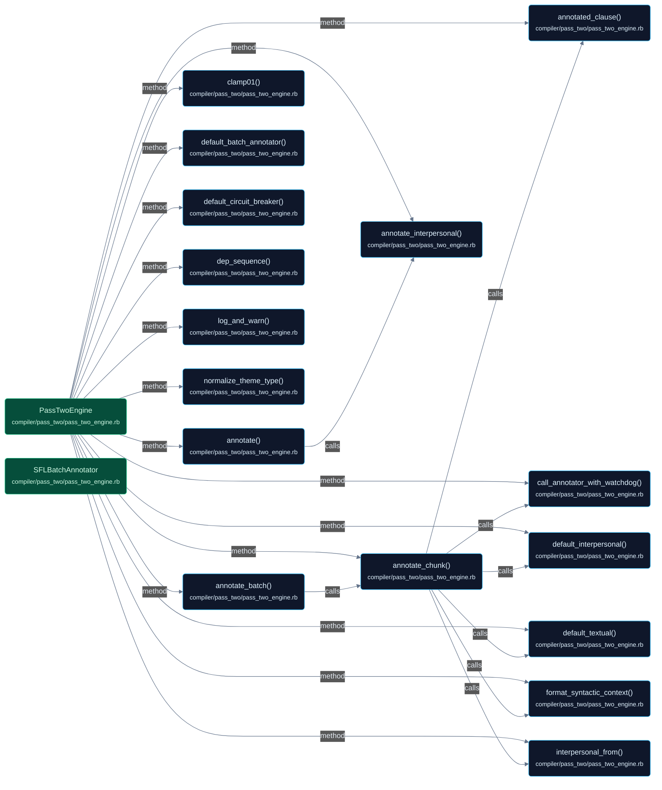

## Callflow 9

```mermaid
%%{init: {"theme": "dark", "themeVariables": {"fontSize": "15.0px", "fontFamily": "Segoe UI, system-ui, sans-serif", "primaryColor": "#1e293b", "primaryTextColor": "#e2e8f0", "primaryBorderColor": "#38bdf8", "secondaryColor": "#0f172a", "tertiaryColor": "#334155", "lineColor": "#64748b", "textColor": "#e2e8f0"}, "flowchart": {"htmlLabels": true, "curve": "basis", "nodeSpacing": 48, "rankSpacing": 64, "padding": 14, "diagramPadding": 10, "useMaxWidth": true}}}%%
flowchart LR
    %% Section: Conversation Analysis (27 nodes, 37 edges)
    subgraph conversation_analysis_compiler_analysis_narrativ_4453dc56["compiler/analysis/narrative_generator.rb"]
        analysis_narrative_generator_digest_de4de09b("Digest<br/><small>compiler/analysis/narrative_generator.rb</small>")
        analysis_narrative_generator_digest_from_result_25a0b57f("from_result()<br/><small>compiler/analysis/narrative_generator.rb</small>")
        analysis_narrative_generator_narrativegenerator_c8f33c62("generate()<br/><small>compiler/analysis/narrative_generator.rb</small>")
        analysis_narrative_generator_narrativegenerator_faf2d70e("NarrativeGenerator<br/><small>compiler/analysis/narrative_generator.rb</small>")
        analysis_narrative_generator_sflnarrator_2b7404e6("SFLNarrator<br/><small>compiler/analysis/narrative_generator.rb</small>")
        analysis_narrative_generator_narrativegenerator_f8107ada("initialize()<br/><small>compiler/analysis/narrative_generator.rb</small>")
        analysis_narrative_generator_sflnarrator_call_3518a2d2("call()<br/><small>compiler/analysis/narrative_generator.rb</small>")
        analysis_narrative_generator_digest_source_c5591de9("source()<br/><small>compiler/analysis/narrative_generator.rb</small>")
        analysis_narrative_generator_digest_to_text_ec47dea8("to_text()<br/><small>compiler/analysis/narrative_generator.rb</small>")
        analysis_narrative_generator_digest_coverage_c23d0b19("coverage()<br/><small>compiler/analysis/narrative_generator.rb</small>")
        analysis_narrative_generator_digest_deep_stringi_45daccf7("deep_stringify()<br/><small>compiler/analysis/narrative_generator.rb</small>")
        analysis_narrative_generator_digest_initialize_09b676aa("initialize()<br/><small>compiler/analysis/narrative_generator.rb</small>")
        analysis_narrative_generator_digest_profiles_has_41c5ffb4("profiles_hash()<br/><small>compiler/analysis/narrative_generator.rb</small>")
        analysis_narrative_generator_digest_turn_line_d825a90e("turn_line()<br/><small>compiler/analysis/narrative_generator.rb</small>")
        analysis_narrative_generator_sflnarrator_initial_c3df9c83("initialize()<br/><small>compiler/analysis/narrative_generator.rb</small>")
    end
    subgraph conversation_analysis_compiler_formatters_csv_fo_969c9aac["compiler/formatters/csv_formatter.rb"]
        formatters_csv_formatter_csvformatter_3f1012c3("CSVFormatter<br/><small>compiler/formatters/csv_formatter.rb</small>")
        formatters_csv_formatter_csvformatter_format_pro_e1c31950("format_process_counts()<br/><small>compiler/formatters/csv_formatter.rb</small>")
        formatters_csv_formatter_csvformatter_headers_eaec50ca("headers()<br/><small>compiler/formatters/csv_formatter.rb</small>")
    end
    analysis_narrative_generator_narrativegenerator_faf2d70e -->|method| analysis_narrative_generator_narrativegenerator_c8f33c62
    analysis_narrative_generator_narrativegenerator_faf2d70e -->|method| analysis_narrative_generator_narrativegenerator_f8107ada
    analysis_narrative_generator_narrativegenerator_f8107ada -->|calls| analysis_narrative_generator_sflnarrator_call_3518a2d2
    analysis_narrative_generator_narrativegenerator_c8f33c62 -->|calls| analysis_narrative_generator_digest_source_c5591de9
    analysis_narrative_generator_narrativegenerator_c8f33c62 -->|calls| analysis_narrative_generator_digest_to_text_ec47dea8
    analysis_narrative_generator_narrativegenerator_c8f33c62 -->|calls| analysis_narrative_generator_sflnarrator_call_3518a2d2
    analysis_narrative_generator_digest_de4de09b -->|method| analysis_narrative_generator_digest_coverage_c23d0b19
    analysis_narrative_generator_digest_de4de09b -->|method| analysis_narrative_generator_digest_deep_stringi_45daccf7
    analysis_narrative_generator_digest_de4de09b -->|method| analysis_narrative_generator_digest_from_result_25a0b57f
    analysis_narrative_generator_digest_de4de09b -->|method| analysis_narrative_generator_digest_initialize_09b676aa
    analysis_narrative_generator_digest_de4de09b -->|method| analysis_narrative_generator_digest_profiles_has_41c5ffb4
    analysis_narrative_generator_digest_de4de09b -->|method| analysis_narrative_generator_digest_source_c5591de9
    analysis_narrative_generator_digest_de4de09b -->|method| analysis_narrative_generator_digest_to_text_ec47dea8
    analysis_narrative_generator_digest_de4de09b -->|method| analysis_narrative_generator_digest_turn_line_d825a90e
    analysis_narrative_generator_digest_from_result_25a0b57f -->|calls| analysis_narrative_generator_digest_coverage_c23d0b19
    analysis_narrative_generator_digest_from_result_25a0b57f -->|calls| analysis_narrative_generator_digest_deep_stringi_45daccf7
    analysis_narrative_generator_digest_from_result_25a0b57f -->|calls| analysis_narrative_generator_digest_profiles_has_41c5ffb4
    analysis_narrative_generator_digest_to_text_ec47dea8 -->|calls| analysis_narrative_generator_digest_turn_line_d825a90e
    analysis_narrative_generator_sflnarrator_2b7404e6 -->|method| analysis_narrative_generator_sflnarrator_call_3518a2d2
    analysis_narrative_generator_sflnarrator_2b7404e6 -->|method| analysis_narrative_generator_sflnarrator_initial_c3df9c83
    formatters_csv_formatter_csvformatter_3f1012c3 -->|method| formatters_csv_formatter_csvformatter_format_pro_e1c31950
    formatters_csv_formatter_csvformatter_3f1012c3 -->|method| formatters_csv_formatter_csvformatter_headers_eaec50ca
    %% Omitted for readability: 9 nodes, 0 edges
    class analysis_narrative_generator_digest_de4de09b klass;
    class analysis_narrative_generator_digest_from_result_25a0b57f function;
    class analysis_narrative_generator_narrativegenerator_c8f33c62 function;
    class analysis_narrative_generator_narrativegenerator_faf2d70e klass;
    class analysis_narrative_generator_sflnarrator_2b7404e6 klass;
    class analysis_narrative_generator_narrativegenerator_f8107ada function;
    class analysis_narrative_generator_sflnarrator_call_3518a2d2 function;
    class analysis_narrative_generator_digest_source_c5591de9 function;
    class analysis_narrative_generator_digest_to_text_ec47dea8 function;
    class analysis_narrative_generator_digest_coverage_c23d0b19 function;
    class analysis_narrative_generator_digest_deep_stringi_45daccf7 function;
    class analysis_narrative_generator_digest_initialize_09b676aa function;
    class analysis_narrative_generator_digest_profiles_has_41c5ffb4 function;
    class analysis_narrative_generator_digest_turn_line_d825a90e function;
    class analysis_narrative_generator_sflnarrator_initial_c3df9c83 function;
    class formatters_csv_formatter_csvformatter_3f1012c3 klass;
    class formatters_csv_formatter_csvformatter_format_pro_e1c31950 function;
    class formatters_csv_formatter_csvformatter_headers_eaec50ca function;
    classDef entry fill:#422006,stroke:#fbbf24,color:#fde68a,stroke-width:1px;
    classDef api fill:#450a0a,stroke:#f87171,color:#fee2e2,stroke-width:1px;
    classDef async fill:#2e1065,stroke:#a78bfa,color:#ede9fe,stroke-width:1px;
    classDef klass fill:#064e3b,stroke:#34d399,color:#d1fae5,stroke-width:1px;
    classDef ui fill:#831843,stroke:#f472b6,color:#fce7f3,stroke-width:1px;
    classDef module fill:#172554,stroke:#60a5fa,color:#dbeafe,stroke-width:1px;
    classDef test fill:#3f3f46,stroke:#a1a1aa,color:#f4f4f5,stroke-width:1px;
    classDef concept fill:#292524,stroke:#a8a29e,color:#fafaf9,stroke-dasharray:4 3;
    classDef function fill:#0f172a,stroke:#38bdf8,color:#e0f2fe,stroke-width:1px;
```

## Callflow 10

```mermaid
%%{init: {"theme": "dark", "themeVariables": {"fontSize": "15.0px", "fontFamily": "Segoe UI, system-ui, sans-serif", "primaryColor": "#1e293b", "primaryTextColor": "#e2e8f0", "primaryBorderColor": "#38bdf8", "secondaryColor": "#0f172a", "tertiaryColor": "#334155", "lineColor": "#64748b", "textColor": "#e2e8f0"}, "flowchart": {"htmlLabels": true, "curve": "basis", "nodeSpacing": 48, "rankSpacing": 64, "padding": 14, "diagramPadding": 10, "useMaxWidth": true}}}%%
flowchart LR
    %% Section: Hybrid Retriever (18 nodes, 17 edges)
    compiler_types_0103137e("types.rb")
    compiler_types_analysisresult_7beff7c2("AnalysisResult<br/><small>sfl/compiler/types.rb</small>")
    compiler_types_annotatedclause_ffd3d9b3("AnnotatedClause<br/><small>sfl/compiler/types.rb</small>")
    compiler_types_cohesionmetrics_bf728e18("CohesionMetrics<br/><small>sfl/compiler/types.rb</small>")
    compiler_types_conversationturn_3fe64342("ConversationTurn<br/><small>sfl/compiler/types.rb</small>")
    compiler_types_dispatchdecision_5fa64a85("DispatchDecision<br/><small>sfl/compiler/types.rb</small>")
    compiler_types_examplepassage_1bda8070("ExamplePassage<br/><small>sfl/compiler/types.rb</small>")
    compiler_types_ideationalpayload_fdfaf973("IdeationalPayload<br/><small>sfl/compiler/types.rb</small>")
    compiler_types_interpersonalpayload_09352c53("InterpersonalPayload<br/><small>sfl/compiler/types.rb</small>")
    compiler_types_keymoment_0c86f98e("KeyMoment<br/><small>sfl/compiler/types.rb</small>")
    compiler_types_narrativereport_b9e8b3f0("NarrativeReport<br/><small>sfl/compiler/types.rb</small>")
    compiler_types_participant_f44bd4e8("Participant<br/><small>sfl/compiler/types.rb</small>")
    compiler_types_speakerprofile_ec550106("SpeakerProfile<br/><small>sfl/compiler/types.rb</small>")
    compiler_types_syntacticclause_db1f85c9("SyntacticClause<br/><small>sfl/compiler/types.rb</small>")
    compiler_types_syntactictoken_a2705bcd("SyntacticToken<br/><small>sfl/compiler/types.rb</small>")
    compiler_types_synthesisresult_d025be6a("SynthesisResult<br/><small>sfl/compiler/types.rb</small>")
    compiler_types_taskresult_a1ef7e9f("TaskResult<br/><small>sfl/compiler/types.rb</small>")
    compiler_types_textualpayload_5d74bbc5("TextualPayload<br/><small>sfl/compiler/types.rb</small>")
    compiler_types_0103137e -->|contains| compiler_types_analysisresult_7beff7c2
    compiler_types_0103137e -->|contains| compiler_types_annotatedclause_ffd3d9b3
    compiler_types_0103137e -->|contains| compiler_types_cohesionmetrics_bf728e18
    compiler_types_0103137e -->|contains| compiler_types_conversationturn_3fe64342
    compiler_types_0103137e -->|contains| compiler_types_dispatchdecision_5fa64a85
    compiler_types_0103137e -->|contains| compiler_types_examplepassage_1bda8070
    compiler_types_0103137e -->|contains| compiler_types_ideationalpayload_fdfaf973
    compiler_types_0103137e -->|contains| compiler_types_interpersonalpayload_09352c53
    compiler_types_0103137e -->|contains| compiler_types_keymoment_0c86f98e
    compiler_types_0103137e -->|contains| compiler_types_narrativereport_b9e8b3f0
    compiler_types_0103137e -->|contains| compiler_types_participant_f44bd4e8
    compiler_types_0103137e -->|contains| compiler_types_speakerprofile_ec550106
    compiler_types_0103137e -->|contains| compiler_types_syntacticclause_db1f85c9
    compiler_types_0103137e -->|contains| compiler_types_syntactictoken_a2705bcd
    compiler_types_0103137e -->|contains| compiler_types_synthesisresult_d025be6a
    compiler_types_0103137e -->|contains| compiler_types_taskresult_a1ef7e9f
    compiler_types_0103137e -->|contains| compiler_types_textualpayload_5d74bbc5
    class compiler_types_0103137e module;
    class compiler_types_analysisresult_7beff7c2 klass;
    class compiler_types_annotatedclause_ffd3d9b3 klass;
    class compiler_types_cohesionmetrics_bf728e18 klass;
    class compiler_types_conversationturn_3fe64342 klass;
    class compiler_types_dispatchdecision_5fa64a85 klass;
    class compiler_types_examplepassage_1bda8070 klass;
    class compiler_types_ideationalpayload_fdfaf973 klass;
    class compiler_types_interpersonalpayload_09352c53 klass;
    class compiler_types_keymoment_0c86f98e klass;
    class compiler_types_narrativereport_b9e8b3f0 klass;
    class compiler_types_participant_f44bd4e8 klass;
    class compiler_types_speakerprofile_ec550106 klass;
    class compiler_types_syntacticclause_db1f85c9 klass;
    class compiler_types_syntactictoken_a2705bcd klass;
    class compiler_types_synthesisresult_d025be6a klass;
    class compiler_types_taskresult_a1ef7e9f klass;
    class compiler_types_textualpayload_5d74bbc5 klass;
    classDef entry fill:#422006,stroke:#fbbf24,color:#fde68a,stroke-width:1px;
    classDef api fill:#450a0a,stroke:#f87171,color:#fee2e2,stroke-width:1px;
    classDef async fill:#2e1065,stroke:#a78bfa,color:#ede9fe,stroke-width:1px;
    classDef klass fill:#064e3b,stroke:#34d399,color:#d1fae5,stroke-width:1px;
    classDef ui fill:#831843,stroke:#f472b6,color:#fce7f3,stroke-width:1px;
    classDef module fill:#172554,stroke:#60a5fa,color:#dbeafe,stroke-width:1px;
    classDef test fill:#3f3f46,stroke:#a1a1aa,color:#f4f4f5,stroke-width:1px;
    classDef concept fill:#292524,stroke:#a8a29e,color:#fafaf9,stroke-dasharray:4 3;
    classDef function fill:#0f172a,stroke:#38bdf8,color:#e0f2fe,stroke-width:1px;
```

## Callflow 11

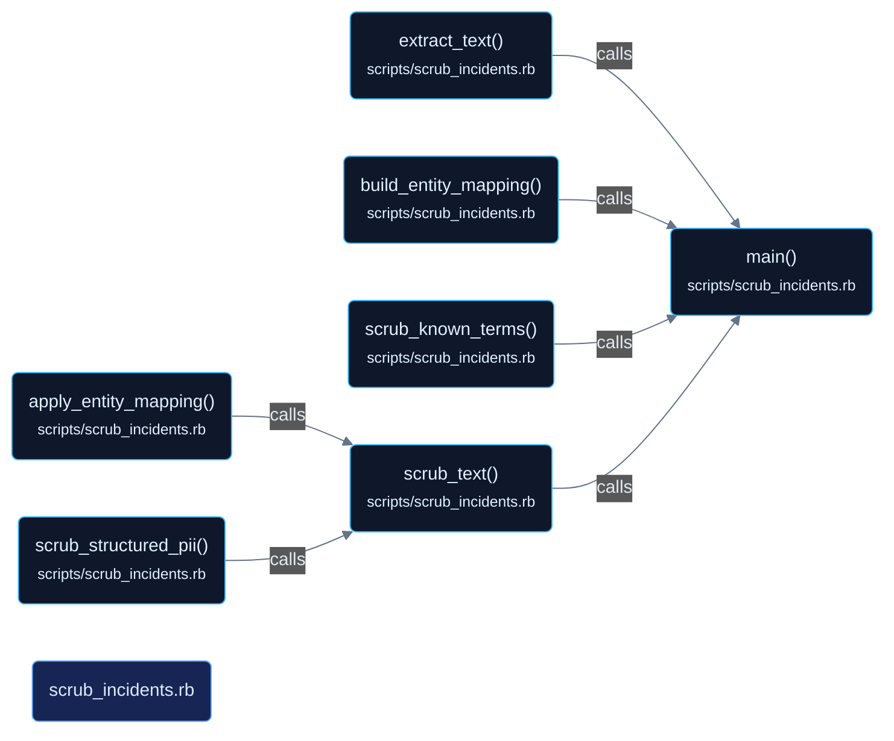

## Callflow 12

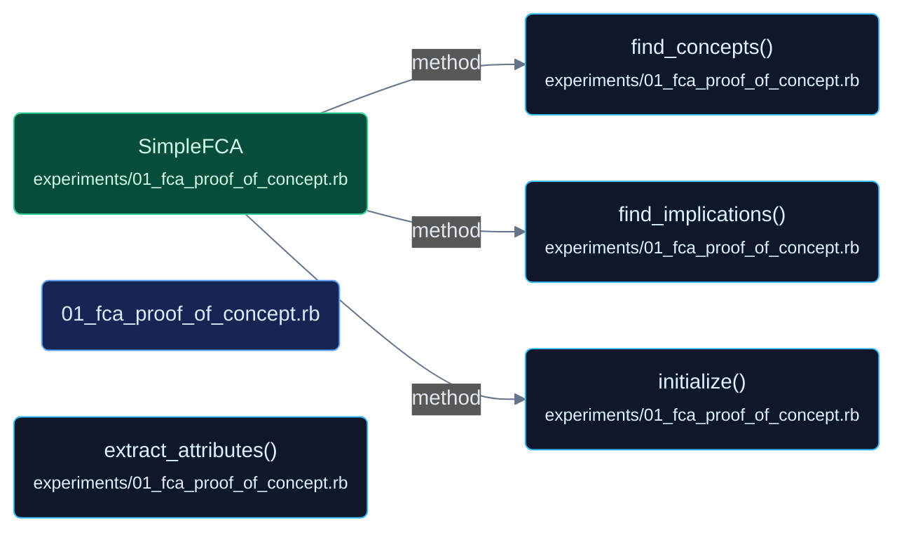

## Callflow 13

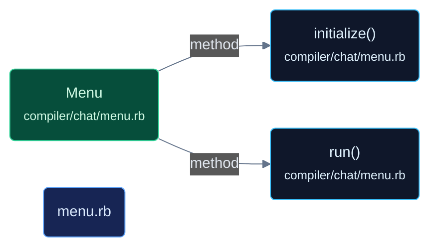

## Callflow 14

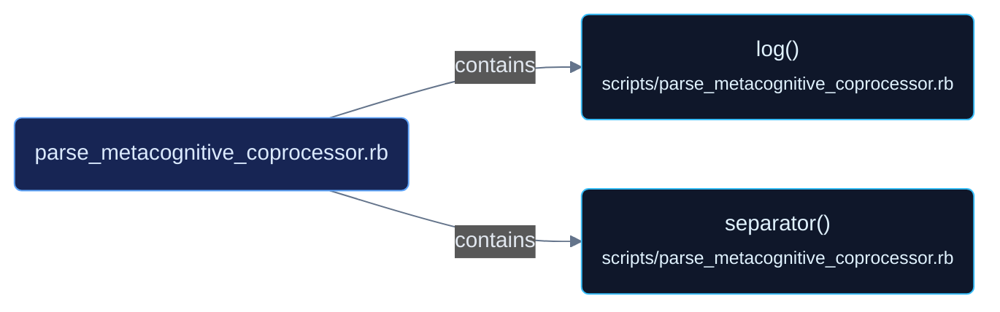

## Callflow 15

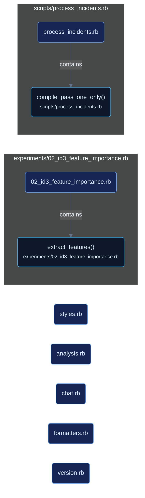
