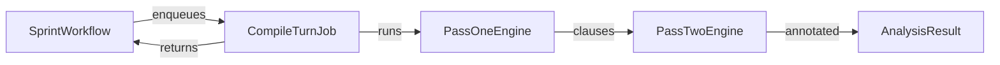

# CompileTurnJob

**Location**: `lib/sfl/compiler/jobs/compile_turn_job.rb`
**Confidence**: EXTRACTED
**Community**: Parallel Processing

---

## Transformation Contract

`CompileTurnJob` **transforms** one raw conversation turn (speaker, timestamp,
message text) **into** a single `AnalysisResult` turn entry **through** the full
Pass 1 → Pass 2 pipeline **when** invoked by the Gush/Sidekiq workflow.

---

## Responsibilities

- Receive one turn from the `SprintWorkflow` batch.
- Reconstruct or build the pipeline dependencies (`Pipeline`, `PassOneEngine`,
  `PassTwoEngine`, formatters) inside the job.
- Execute Pass 1 (spaCy syntactic extraction) and Pass 2 (LLM interpersonal
  annotation) for that turn.
- Return a serializable payload that the workflow reassembles into the final
  report.
- Catch and report failures so one bad turn does not stop the batch.

---

## Key Components

| Component | Type | Role |
|-----------|------|------|
| `CompileTurnJob` | Sidekiq worker | Entry point for per-turn processing |
| `perform` | Method | Parses args, runs the pipeline, returns results |
| `Pipeline` | Class | Compiles clauses and payloads for one turn |
| `TurnCompiler` logic | Inline | Reuses existing pipeline classes inside the job |

---

## Dependencies

**Requires**:
- **Redis + Gush**: Schedules and distributes jobs across processes.
- **Pipeline / PassOneEngine / PassTwoEngine**: Reused inside the job to do the
  actual compilation.
- **PostgreSQL + pgvector**: Optional; only needed if embeddings or `--store`
  behavior is triggered from within the workflow.

**Enables**:
- **SprintWorkflow**: Aggregates per-turn results into a complete report.
- **CLI `--live` flag**: Replaces sequential turn processing with parallel jobs.

---

## Interactions

---

## User/Developer Experience

Consumers of the CLI do not interact with `CompileTurnJob` directly. Adding
`--live` to a `conversation` command causes the CLI to enqueue one job per turn
and wait for completion. The per-turn progress line shows the same `[OK]` /
`DEFAULTED` status as the sequential path.

Developers extending the parallel path should keep the job self-contained:
rebuild any needed services inside `perform` rather than relying on shared
in-memory state from the parent process.

---

## Known Limitations

- Job startup overhead makes `--live` slower than sequential processing for very
  small conversations (fewer than ~20 turns).
- Each job initializes its own Python interpreter through PyCall, which adds
  memory but avoids the GIL/GC deadlock described in AGENTS.md.

---

## Design Rationale

Running Pass 1 and Pass 2 in the same Ruby process with threads is unsafe
because spaCy (via PyCall) and the Ruby LLM runtime contend on the GIL and can
deadlock during GC. Forking each turn into a Sidekiq job isolates the Python
interpreter per process and keeps the CLI interface unchanged.

---

## Ruby Pragmatist Insight

`CompileTurnJob` is like a food-truck kitchen that is fully equipped for every
order. It costs more to set up each time than a shared line, but it guarantees
that garlic and ice cream never share the same prep surface.
