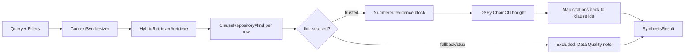

# ContextSynthesizer

**Location:** `lib/sfl/compiler/retrieval/context_synthesizer.rb`
**Confidence:** EXTRACTED

---

## Transformation Contract

```
Query + Filters → [ContextSynthesizer.synthesize] → Types::SynthesisResult
```

| Input | Output | Condition |
|-------|--------|-----------|
| String (query), Hash (filters), Integer (limit) | `SynthesisResult` with `answer:`, `clauses:`, `cited_clause_ids:`, `confidence:` | retrieval returns ≥1 clause and ≥1 is citable |
| Empty retrieval | `SynthesisResult` with `answer: nil`, `clauses: []` | no LLM call made |
| All retrieved clauses fallback/stub-sourced (`include_fallback: false`) | `SynthesisResult` with `answer:` = Data Quality preamble only, `clauses:` = full retrieved set | no LLM call made |
| Synthesizer returns a type-invalid result | `SynthesisResult` with `answer: nil`, evidence still populated | degrades rather than raising |

---

## Responsibilities

- Retrieve candidate clauses via `HybridRetriever#retrieve` (RRF + scalar stance filters)
- Exclude clauses whose interpersonal annotation came from Pass 2's degradation ladder (`annotation_source` `"fallback"`/`"stub"`) from what the LLM may cite — a fallback 0.5 shouldn't silently ground an answer
- Build a numbered, SFL-annotated evidence block and call the LLM synthesizer (`SFLSynthesizer`, a `DSPy::ChainOfThought` over `SynthesisSignature`)
- Map the LLM's cited evidence numbers back to real clause IDs, dropping out-of-range numbers rather than trusting them
- Flatten each retrieved clause's SFL fields (mood/tenor/modality/process_type/annotation_source) onto the row it returns, so callers get evidence stance without a second round trip per clause

---

## Key Components

| Component | Role |
|-----------|------|
| `initialize(retriever:, clause_repo:, synthesizer: nil)` | Injects `HybridRetriever`, `ClauseRepository`, and an optional `#call(query, evidence)` synthesizer (defaults to `SFLSynthesizer`) |
| `synthesize(query, filters:, limit:, include_fallback:)` | Main entry: query → `SynthesisResult` |
| `partition_citable(enriched, include_fallback)` | Splits retrieved rows into what the LLM may cite vs. what's excluded as fallback-sourced |
| `public_clause_view(enriched_row)` | Flattens `mood`/`tenor`/`modality_weight`/`process_type`/`annotation_source` onto a clause row, dropping the internal `:annotations` hash |
| `format_evidence(enriched)` | Builds the numbered `"[1] text\n    (mood=..., tenor=..., ...)"` block the LLM sees |
| `llm_sourced?(enriched_row)` | Predicate: is this row's interpersonal annotation trusted (`Types::TRUSTED_ANNOTATION_SOURCES`)? |

---

## Dependencies

| Dependency | Purpose |
|------------|---------|
| `HybridRetriever` | Candidate clause retrieval (RRF + stance filters) |
| `ClauseRepository` | Fetches each retrieved clause's full ideational/interpersonal payload by id |
| `DSPy::ChainOfThought` | LLM call over `SynthesisSignature` |
| `Types::SynthesisResult` / `Types::TRUSTED_ANNOTATION_SOURCES` | Output struct and the trusted-source allowlist |

---

## Interactions



---

## User/Developer Experience

**Developer** calls `ContextSynthesizer.new(retriever:, clause_repo:).synthesize(query, filters:, limit:)` and receives a `SynthesisResult` whose `clauses:` array carries the *full retrieved set* (not just citable ones) — each row a flattened `RetrievedClauseSummary` plus `mood`/`tenor`/`modality_weight`/`process_type`/`annotation_source`. `cited_clause_ids` names the subset the LLM actually relied on.

**User** interacts via `sfl-analyze context "question"` (CLI) or `POST /synthesize` (Falcon API — see `api/server.rb:139`), which serializes the result via `Types.dump` and returns it as-is.

---

## Known Limitations

1. **Evidence stance is per-window, not per-corpus** — the `mood`/`tenor`/`modality` flattened onto each row describes that one clause; there is no aggregate stance summary at the `SynthesisResult` level.
2. **LLM failures propagate, not degrade** — unlike Pass 2, a synthesis call that raises (timeout, provider error, quota) is not caught into a graceful fallback; it surfaces as a 500 from the API. This is a deliberate choice (a failed LLM call has no useful default "answer"), not an oversight.
3. **No knowledge of Axiomatic summaries** — retrieval only ever queries `clauses`/`interpersonal_payloads`/`embeddings`; Rolling Synthesis's compressed `axiomatic_summaries` table is a separate, unconnected structure (see `docs/modules/` — no dedicated doc yet, tracked in the Rolling Synthesis backlog).

---

## Design Rationale

`public_clause_view` exists because `ClauseRepository#find` was already being called to decide the citable/fallback split — the ideational/interpersonal payloads were being fetched and then discarded before this change. Flattening the scalar SFL fields onto the returned row costs nothing extra and is what the ConvoWorkbench Safe RAG Hypothesis Validator view needs to show evidence stance next to each cited clause, without a second `GET /clauses` round trip per row.

## Ruby Pragmatist Insight

> ContextSynthesizer is a **judge**, not a search engine — `HybridRetriever` finds candidates, but the synthesizer decides which ones are admissible evidence (trusted annotation source) before it will let the LLM cite them. The Data Quality preamble is the judge's own dissent noted in the record: if evidence had to be excluded, the answer says so instead of pretending the excluded clauses never existed.

---

## Trace Path

```
api/server.rb:139        synthesize
  └─► context_synthesizer.rb:35   synthesize
       ├─► hybrid_retriever.rb:38  retrieve
       ├─► clause_repository.rb:141 find (per retrieved row)
       ├─► context_synthesizer.rb:59  partition_citable
       ├─► context_synthesizer.rb:107 public_clause_view (per row, for the response)
       ├─► context_synthesizer.rb:132 format_evidence
       └─► context_synthesizer.rb:66  synthesize_from_citable
            └─► SFLSynthesizer#call → DSPy::ChainOfThought
```
