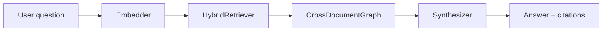

# CrossDocumentGraph

**Location**: `lib/sfl/compiler/cross_document_graph.rb`
**Confidence**: INFERRED
**Community**: Retrieval

---

## Transformation Contract

`CrossDocumentGraph` **transforms** a natural-language question plus stored
clause/embedding records **into** a synthesized answer with confidence score
**through** entity resolution, document-spanning graph traversal, and
RRF-ranked evidence selection.

---

## Responsibilities

- Embed the user's question.
- Retrieve candidate clauses from multiple documents using semantic + keyword
  search (same RRF strategy as `HybridRetriever`).
- Build a graph of documents, entities, clauses, and query nodes.
- Rank evidence across the graph.
- Synthesize an answer, confidence score, and cited clause list.

---

## Key Components

| Component | Type | Role |
|-----------|------|------|
| `CrossDocumentGraph` | Class | Entry point and orchestrator |
| `answer(query, ...)` | Method | Main public API returning a synthesis |
| Graph builder | Internal | Links documents, entities, clauses, and query |
| RRF ranker | Reused | Combines semantic and keyword ranks |

---

## Dependencies

**Requires**:
- `HybridRetriever` or equivalent retrieval back-end.
- Stored clauses in PostgreSQL (ingested via `sfl-analyze documentation ... --store`).
- Ollama/RubyLLM embedder for question embedding.

**Enables**:
- Multi-document reasoning in library code and future CLI commands.
- Comparative questions ("how does X differ from Y?") that need explicit
  document nodes.

---

## Interactions



---

## User/Developer Experience

There is no dedicated CLI subcommand yet. Use the class directly from a script
or REPL after calling `Bootstrap.call`:

```ruby
graph = SFL::Compiler::CrossDocumentGraph.new
answer = graph.answer(
  "How do deployment practices differ between the API and web docs?",
  min_modality: 0.6,
  limit: 8
)
puts answer.text
puts answer.confidence
```

---

## Known Limitations

- Graph construction is currently query-time only; there is no pre-computed
  document graph in PostgreSQL.
- The complexity score is higher than flat `context` retrieval, so it is best
  suited to questions that explicitly compare or relate multiple documents.

---

## Design Rationale

A flat result list works well for "what does the corpus say about X?", but
comparative questions need to know which clause belongs to which document and
which entities appear in both. Building an explicit document → entity → clause
graph makes those relationships first-class without redesigning the storage
layer.

---

## Ruby Pragmatist Insight

`CrossDocumentGraph` is like a research librarian who pulls related books,
maps where the same names appear, and then writes a single summary that points
back to the shelf mark of every quoted source.
