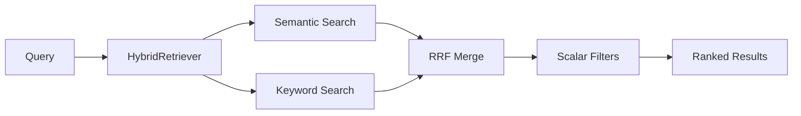

# HybridRetriever

**Location:** `lib/sfl/compiler/retrieval/hybrid_retriever.rb`
**Confidence:** EXTRACTED

---

## Transformation Contract

```
Query + Filters → [HybridRetriever.retrieve] → Array<Hash> (ranked results)
```

| Input | Output | Condition |
|-------|--------|-----------|
| String (query), Hash (filters) | `Array<Hash>` with clause_id, text, scores | query non-empty |
| Empty query | `[]` | early return |

---

## Responsibilities

- Execute semantic search via pgvector cosine similarity
- Execute keyword search via PostgreSQL full-text search
- Merge results using Reciprocal Rank Fusion (RRF)
- Apply scalar metadata filters (mood, modality, tenor, process_type, source_type)
- Log timing and correlation IDs via Journald

---

## Key Components

| Component | Role |
|-----------|------|
| `initialize(db:, embedder:)` | Database connection and optional embedder |
| `retrieve(query, limit:, filters:)` | Main entry: query → ranked results |
| `semantic_search(query, limit:)` | pgvector cosine similarity search |
| `keyword_search(query, limit:)` | PostgreSQL `plainto_tsquery` search |
| `reciprocal_rank_fusion(...)` | Merge semantic + keyword results with RRF |
| `apply_filters(results, filters:)` | Filter by mood, modality, tenor, etc. |

---

## Dependencies

| Dependency | Purpose |
|------------|---------|
| `pg` / `pgvector` | Vector similarity search |
| `Sequel` | SQL query building |
| `Embedder` | Text → vector embedding |
| `Journald::Logger` | Structured logging |

---

## Interactions



---

## User/Developer Experience

**Developer** calls `HybridRetriever.new(db:, embedder:).retrieve(query, filters:)` and receives an array of hashes:
- `clause_id` — clause identifier
- `text` — clause text
- `document_id` — source document
- `similarity_score` — semantic similarity (0-1)
- `rrf_score` — fused rank score

**User** interacts via CLI `--query` or API endpoint; results are formatted by `MarkdownFormatter` or `JSONFormatter`.

---

## Known Limitations

1. **Embedder required** — semantic search returns `[]` if embedder is nil
2. **Keyword AND** — `plainto_tsquery('simple', ...)` requires ALL words to match
3. **Filter N+1** — scalar filters pre-fetch payloads to avoid N+1, but large result sets still hit DB

---

## Design Rationale

RRF fusion (k=60) balances semantic similarity with lexical matching. Scalar filters operate post-merge to avoid query complexity. The embedder is optional to support keyword-only mode when embeddings are unavailable.

---

## Ruby Pragmatist Insight

> HybridRetriever is a **curator** — it doesn't create knowledge, it surfaces the most relevant pieces from a vast collection. Like a librarian who knows both the Dewey Decimal system and the card catalog, it combines two search strategies to find what you need, then applies your preferences (filters) to refine the results.

---

## Trace Path

```
api/server.rb:96  compile_pipeline
  └─► hybrid_retriever.rb:38  retrieve
       ├─► hybrid_retriever.rb:82  semantic_search
       ├─► hybrid_retriever.rb:112 keyword_search
       ├─► hybrid_retriever.rb:144 reciprocal_rank_fusion
       └─► hybrid_retriever.rb:166 apply_filters
```
