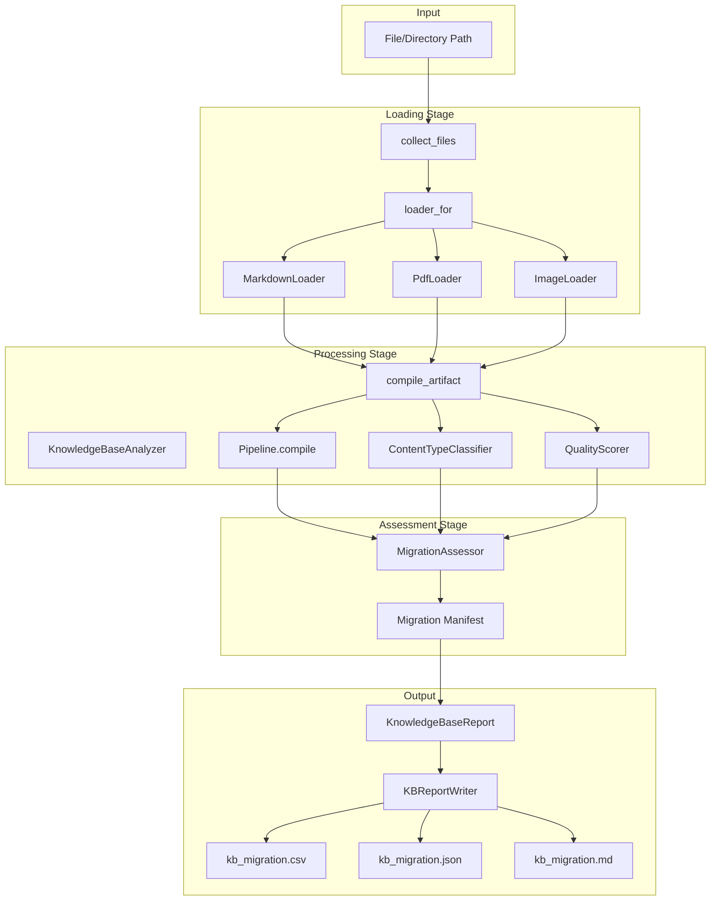

# KnowledgeBaseAnalyzer

**Location**: `lib/sfl/compiler/analysis/knowledge_base_analyzer.rb`
**Confidence**: EXTRACTED
**Community**: Knowledge Base Analysis
**God Node Rank**: #5 (12 edges)

---

## Transformation Contract *(Material Processes — lead with this)*

KnowledgeBaseAnalyzer **transforms** a file or directory of documents **into** a KnowledgeBaseReport **through** multi-stage analysis of content type, quality, and migration readiness **when** all sections are properly loaded and compiled.

> KnowledgeBaseReport **contains** artifacts with SFL annotations, migration manifest, content type distribution, quality distribution, and staleness flags.

---

## Responsibilities

- Collect text files (`.md`, `.pdf`) and optionally image files (`.png`, `.jpg`, `.jpeg`, `.webp`)
- Load sections via appropriate loaders (MarkdownLoader, PdfLoader, ImageLoader)
- Compile each section through the full Pipeline (Pass 1 + Pass 2)
- Classify content types using ContentTypeClassifier
- Score quality using QualityScorer (source, modality, substance, freshness)
- Assess migration readiness using MigrationAssessor
- Detect staleness (files older than 18 months)
- Generate multi-format reports (CSV, JSON, Markdown)

---

## Key Components

| Component | Type | Transformation / Role | Confidence |
|-----------|------|-----------------------|------------|
| `Pipeline` | Dependency | **Compiles** text → AnnotatedClause[] via Pass 1 + Pass 2 | EXTRACTED |
| `ClauseRepository` | Dependency | **Stores** clauses when `store: true` | EXTRACTED |
| `ContentTypeClassifier` | Dependency | **Classifies** sections into content types | EXTRACTED |
| `QualityScorer` | Dependency | **Scores** artifact quality (0.0–1.0) | EXTRACTED |
| `MigrationAssessor` | Dependency | **Recommends** migration actions (keep/update/archive/review) | EXTRACTED |
| `MarkdownLoader` | Dependency | **Loads** `.md` files into sections | EXTRACTED |
| `PdfLoader` | Dependency | **Loads** `.pdf` files into sections | EXTRACTED |
| `ImageLoader` | Dependency | **Loads** image files via vision model | EXTRACTED |

---

## Dependencies *(Relational Processes)*

**Requires**:
- **[Pipeline]**: **provides** AnnotatedClause[] **for** analysis input
  - Failure: No clauses to analyze | Mitigation: Returns empty report
- **[MarkdownLoader]**: **loads** `.md` sections with frontmatter
  - Failure: File parse error | Mitigation: Skips file with warning
- **[PdfLoader]**: **loads** `.pdf` sections
  - Failure: PDF parse error | Mitigation: Skips file with warning
- **[ImageLoader]**: **loads** image sections via vision model
  - Failure: Vision model error | Mitigation: Skips file with warning
- **[ContentTypeClassifier]**: **classifies** content types
  - Failure: Classification error | Mitigation: Defaults to `:technical_reference`
- **[QualityScorer]**: **scores** artifact quality
  - Failure: Scoring error | Mitigation: Returns 0.0
- **[MigrationAssessor]**: **recommends** migration actions
  - Failure: Assessment error | Mitigation: Defaults to `:review`

**Enables**:
- **[KBReportWriter]**: **uses** KnowledgeBaseReport **for** CSV/JSON/Markdown output
- **[Formatters]**: **uses** artifacts **for** detailed reporting
- **[CLI]**: **uses** report **for** user-facing output

---

## Interactions



---

## What Users / Developers Experience *(Mental Processes)*

- **First encounter**: Users **typically** see file loading progress **and** then artifact-by-artifact analysis results.
- **After regular use**: Quality scores **often reveal** content health **while** staleness flags **highlight** outdated sections.
- **Debugging focus**: Data quality warnings **frequently point to** fallback annotations **or** vision model failures.

---

## Known Limitations

**Works well when**:
- Documents have clear section structure (headings in markdown)
- Files are properly formatted (valid markdown, non-corrupted PDF)
- Multiple sections provide statistical significance for quality metrics
- Frontmatter contains `last updated` or `last_updated` fields

**May struggle with**:
- Single-section documents (limited aggregation value)
- Missing frontmatter (affects staleness detection)
- Very short sections (<5 clauses)
- Images without vision model configured

**Requires workarounds for**:
- No vision model → ImageLoader returns empty sections
- No frontmatter → staleness defaults to file mtime
- All fallback annotations → quality score drops significantly

---

## Analysis Dimensions

### Content Type Classification

ContentTypeClassifier **categorizes** sections by content type:

| Content Type | Description | Migration Action |
|--------------|-------------|------------------|
| `ai_generated` | AI-generated content | review |
| `draft` | Incomplete/draft content | review |
| `code_snippet` | Code examples | review |
| `image` | Visual content | review |
| `technical_reference` | API docs, specs | keep (if quality ≥ 0.65) |
| `tutorial` | How-to guides | keep (if quality ≥ 0.65) |

**Confidence**: EXTRACTED from ContentTypeClassifier implementation.

---

### Quality Scoring

QualityScorer **calculates** quality on four dimensions:

| Dimension | Weight | Calculation | Purpose |
|-----------|--------|-------------|---------|
| Source | 40% | Weighted average of annotation sources | Measures LLM vs fallback ratio |
| Modality | 30% | Average modality_weight | Measures certainty level |
| Substance | 20% | min(clause_count / 20, 1.0) | Measures content depth |
| Freshness | 10% | 1.0 - (months_old / 18) | Measures content age |

**Source Weights**:
- `llm`: 1.0
- `fallback`: 0.4
- `stub`: 0.1
- `chunk_artifact`: 0.15

**Confidence**: EXTRACTED from QualityScorer implementation.

---

### Migration Assessment

MigrationAssessor **recommends** actions based on content type and quality:

| Action | Condition | Reason |
|--------|-----------|--------|
| `review` | AI-generated, draft, code_snippet, image | Requires manual decision |
| `keep` | technical_reference or tutorial AND quality ≥ 0.65 | High-quality, migrate as-is |
| `update` | quality ≥ 0.50 | Adequate quality, review before migrating |
| `archive` | quality < 0.35 | Low quality, archive candidate |

**Confidence**: EXTRACTED from MigrationAssessor implementation.

---

### Staleness Detection

Staleness **flags** artifacts older than 18 months:

| Check | Threshold | Action |
|-------|-----------|--------|
| `last_updated` from frontmatter | > 18 months | Flag as stale |
| File mtime (if no frontmatter) | > 18 months | Flag as stale |

**Confidence**: EXTRACTED from staleness_flags implementation.

---

## Design Rationale

### Multi-Stage Analysis

**Context**: Single-pass analysis **cannot capture** content health comprehensively.

**Decision**: Separate loading, compilation, classification, scoring, and assessment stages.

**Rationale**: **Provides** modularity **while** each stage **reveals** different aspects of content quality.

**Trade-offs**: More complex pipeline; some metrics **may** be redundant for certain use cases.

**Confidence**: EXTRACTED from KnowledgeBaseAnalyzer implementation.

### Optional Image Analysis

**Context**: Vision model analysis **is expensive** and **not always needed**.

**Decision**: Gate image analysis behind `analyze_images` flag.

**Rationale**: **Enables** cost control **while** preserving capability for comprehensive analysis.

**Trade-offs**: Images skipped by default; users must explicitly opt-in.

**Confidence**: EXTRACTED from `analyze_images` parameter usage.

### Store vs Analyze-Only

**Context**: Database storage **is optional** for analysis-only use cases.

**Decision**: Gate storage behind `store` flag with optional ClauseRepository.

**Rationale**: **Enables** lightweight analysis **while** preserving storage capability.

**Trade-offs**: Embeddings not generated in analyze-only mode; retrieval not available.

**Confidence**: EXTRACTED from `store` parameter usage.

---

## Ruby Pragmatist Insight

KnowledgeBaseAnalyzer works like a **librarian conducting a collection audit** — it **takes the raw books (files) and evaluates each one for relevance, quality, and preservation needs**, much like a skilled librarian assessing a library's collection, **while each book (section) undergoes multiple evaluation stages and the librarian must ensure they all receive appropriate treatment based on their individual characteristics**.

---

## Trace Path

### CLI Entry Point

```
CLI.run_knowledge_base (cli.rb:357)
  ├─ StopFlag.new + install_interrupt_trap (cli.rb:358-359)
  ├─ Bootstrap.call (cli.rb:361)
  ├─ Pipeline.new (cli.rb:362-370)
  ├─ KnowledgeBaseAnalyzer.new (cli.rb:372-379)
  └─ analyzer.analyze (cli.rb:381-386)
       │
       ├─ KnowledgeBaseAnalyzer.analyze (knowledge_base_analyzer.rb:47)
       │   ├─ load_all_sections (knowledge_base_analyzer.rb:99)
       │   │   ├─ collect_files (knowledge_base_analyzer.rb:114)
       │   │   └─ loader_for (knowledge_base_analyzer.rb:126)
       │   │       ├─ .md → MarkdownLoader.load
       │   │       ├─ .pdf → PdfLoader.load
       │   │       └─ .png/.jpg → ImageLoader.new.sections
       │   │
       │   ├─ tuples.each → compile_artifact (knowledge_base_analyzer.rb:139)
       │   │   ├─ pipeline.compile
       │   │   ├─ ContentTypeClassifier.classify (content_type_classifier.rb:31)
       │   │   └─ QualityScorer.score (quality_scorer.rb:22)
       │   │
       │   ├─ MigrationAssessor.assess (migration_assessor.rb:26)
       │   └─ Types::KnowledgeBaseReport.new (knowledge_base_analyzer.rb:82)
       │
       └─ Output
           └─ KBReportWriter.write (cli.rb:388)
               ├─ kb_migration.csv
               ├─ kb_migration.json
               └─ kb_migration.md
```
