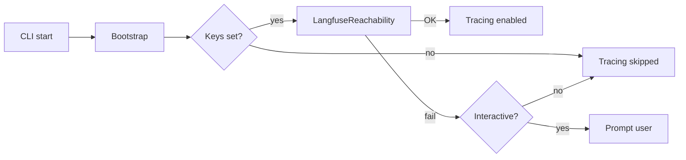

# LangfuseReachability

**Location**: `lib/sfl/compiler/langfuse_reachability.rb`
**Confidence**: INFERRED
**Community**: Observability

---

## Transformation Contract

`LangfuseReachability` **transforms** raw environment variables and a network
endpoint **into** a yes/no/skip decision **about** whether OpenTelemetry tracing
should be enabled **when** the CLI starts.

---

## Responsibilities

- Skip the check entirely when `LANGFUSE_PUBLIC_KEY` or `LANGFUSE_SECRET_KEY`
  are unset.
- Issue a lightweight HTTP request to the configured `LANGFUSE_HOST`.
- Return reachable/unreachable status plus a human-readable message.
- Keep the check fast enough that it does not dominate CLI startup time.

---

## Key Components

| Component | Type | Role |
|-----------|------|------|
| `LangfuseReachability` | Class / Module | Main check entry point |
| `reachable?` | Method | Returns boolean status |
| `message` | Method | Explains the decision for prompts or logs |

---

## Dependencies

**Requires**:
- `net/http` or an HTTP client available in the Ruby environment.
- Valid `LANGFUSE_PUBLIC_KEY` / `LANGFUSE_SECRET_KEY` in `.env` or already
  exported.
- Optional `LANGFUSE_HOST` override.

**Enables**:
- `Bootstrap#configure_observability`: Only registers Langfuse/OpenTelemetry if
  the endpoint is confirmed reachable.

---

## Interactions

---

## User/Developer Experience

If the Langfuse host is down and you run the CLI interactively, you see a
prompt asking whether to continue without tracing. In CI or scripts, the CLI
continues silently. Use `--disable-tracing` to bypass the check completely.

---

## Known Limitations

- A transient network blip can make tracing look unavailable even when Langfuse
  is normally healthy. The check is intentionally simple rather than retried.
- The prompt only works in TTY mode; headless users must rely on
  `--disable-tracing` or accept the silent skip.

---

## Design Rationale

Tracing failures are frustrating because they look like application failures:
spans fail to flush, errors leak into stderr, and users blame the analysis
pipeline. A tiny pre-flight check separates observability health from analysis
health, giving the user a clear choice instead of a half-working trace stream.

---

## Ruby Pragmatist Insight

`LangfuseReachability` is the bouncer at the observability club. It checks your
name on the list before you walk in, so you don't discover the party ended only
after you've ordered a drink.
