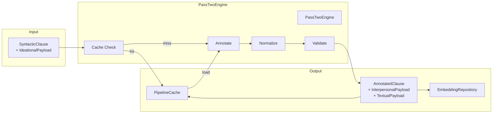

# PassTwoEngine

**Location**: `lib/sfl/compiler/pass_two/pass_two_engine.rb`
**Confidence**: EXTRACTED
**Community**: Pass Two Engine (LLM)
**God Node Rank**: #1 (21 edges - most connected node)

---

## Transformation Contract *(Material Processes — lead with this)*

PassTwoEngine **transforms** SyntacticClause objects with IdeationalPayload **into** AnnotatedClause objects with InterpersonalPayload and TextualPayload **through** LLM-based annotation using DSPy.rb signatures **when** LLM endpoint is configured and accessible.

> If cache is available, PassTwoEngine **loads** pre-computed annotations **from** PipelineCache **using** deterministic cache keys (EXTRACTED from cache implementation).

---

## Responsibilities

- Orchestrate LLM calls for interpersonal metafunction annotation (mood, modality_weight, tenor, speaker_attitude)
- Extract textual metafunction features (topical_theme, textual_theme, interpersonal_theme, rheme, theme_type)
- Normalize and validate theme_type values against allowed enum
- Generate embedding vectors for annotated clauses (optional)
- Cache intermediate results for resume capability
- Handle LLM failures with circuit breaker pattern

---

## Key Components

| Component | Type | Transformation / Role | Confidence |
|-----------|------|-----------------------|------------|
| `SFLAnnotator` | Class | **Performs** actual LLM annotation for a single clause | EXTRACTED |
| `SFLBatchAnnotator` | Class | **Batches** clauses for efficient LLM processing | EXTRACTED |
| `SFLSignature` | DSPy Signature | **Defines** prompt template and output schema for interpersonal annotation | EXTRACTED |
| `SFLBatchSignature` | DSPy Signature | **Defines** batch processing signature | EXTRACTED |
| `ClauseAnnotation` | Struct | **Represents** raw LLM output before structuring | EXTRACTED |
| `normalize_theme_type()` | Method | **Transforms** raw theme_type strings **into** validated enum values | EXTRACTED |
| `interpersonal_from()` | Method | **Converts** LLM output **into** InterpersonalPayload struct | EXTRACTED |
| `textual_from()` | Method | **Converts** LLM output **into** TextualPayload struct with validation | EXTRACTED |

---

## Dependencies *(Relational Processes)*

**Requires**:
- **[DSPy.rb]**: **provides** LLM orchestration framework **for** prompt management and batch processing
  - Failure: Annotation fails with clear error | Mitigation: Version check in bootstrap
- **[RubyLLM]**: **provides** Ollama/OpenAI embedding capabilities **for** vector generation
  - Failure: Embedding returns nil | Mitigation: Circuit breaker with fallback to stub values
- **[PipelineCache]**: **provides** disk-based caching **for** resume capability
  - Failure: Cache read/write fails | Mitigation: Warning logged, continues without cache
- **[ClauseRepository]**: **provides** syntactic clauses **for** annotation input
  - Failure: No clauses to annotate | Mitigation: Early return with empty results

**Enables**:
- **[ConversationAnalyzer]**: **uses** AnnotatedClause objects **for** turn-level aggregation and insight generation
- **[HybridRetriever]**: **uses** embedding vectors **for** semantic similarity search
- **[NarrativeGenerator]**: **uses** complete AnalysisResult **for** human-readable narrative generation

---

## Interactions

---

## What Users / Developers Experience *(Mental Processes)*

- **First encounter**: Developers **typically focus on** the prompt templates in SFLSignature **and often** need to adjust the output parsing in interpersonal_from **when** LLM output format changes.
- **After regular use**: The circuit breaker pattern **becomes apparent** as the system gracefully handles LLM timeouts **while** caching **reduces** repeated annotation costs.
- **Debugging focus**: Invalid theme_type values **frequently trace to** missing entries in the normalize_theme_type allowed_types list **or** typos in LLM prompts.

---

## Known Limitations

**Works well when**:
- LLM prompts are well-calibrated for SFL concepts (mood, modality, tenor, theme)
- Input text is syntactically valid English
- Theme types are from the allowed enum (unmarked, marked, interrogative, imperative, multiple, topical, topical_unmarked, simple, existential, clausal, textual, interjection, interpersonal)
- Circuit breaker thresholds are tuned for the LLM's reliability

**May struggle with**:
- Ambiguous or creative LLM output that doesn't match expected schema
- Languages other than English (spaCy model dependent)
- Very long clauses that exceed LLM context limits
- High-frequency LLM failures without proper circuit breaker configuration

**Requires workarounds for**:
- Compound theme types (e.g., "textual + topical") → normalized to first valid type
- Legacy values (e.g., "topical_unmarked") → mapped to standard "unmarked"
- Typos (e.g., "topual") → corrected via normalization

---

## Design Rationale

### Theme Type Normalization

**Context**: LLM output for theme_type **varies** across runs and models.

**Decision**: Implement normalize_theme_type() method with validation.

**Rationale**: **Enables** consistent theme_type values **despite** LLM variability. Handles typos, compound types, legacy values, and nil inputs.

**Trade-offs**: Some semantic nuance **may be lost** when compound types are reduced to single values.

**Confidence**: EXTRACTED from PassTwoEngine implementation and test suite.

---

### Circuit Breaker Pattern

**Context**: LLM calls **may fail** or timeout.

**Decision**: Use CircuitBreaker gem for fault tolerance.

**Rationale**: **Prevents** cascading failures **when** LLM endpoints are unreliable. Circuit opens after 5 failures, resets after 60 seconds.

**Trade-offs**: Failed calls return nil, requiring downstream handling.

**Confidence**: EXTRACTED from Embedder and PassTwoEngine circuit_method declarations.

---

## Ruby Pragmatist Insight

PassTwoEngine works like a **skilled linguistic artisan** — it **takes the raw syntactic clay from Pass 1 and carefully molds it into rich semantic sculptures with mood, modality, and theme details**, much like a potter transforming simple clay into intricate pottery, **while the kiln (LLM) occasionally cracks under heat and the artisan must pause to let it cool (circuit breaker) before continuing with the next piece**.
