# PipelineCache

**Location**: `lib/sfl/compiler/storage/pipeline_cache.rb`
**Confidence**: EXTRACTED
**Community**: Pipeline Cache
**God Node Rank**: #2 (19 edges)

---

## Transformation Contract *(Material Processes — lead with this)*

PipelineCache **transforms** in-memory AnnotatedClause and related objects **into** JSON files on disk **keyed by** deterministic SHA256 hash of document_id + sentence_index + clause_text **enabling** resume capability after partial pipeline failures.

> The cache **stores** intermediate results from both Pass 1 (syntactic parsing) and Pass 2 (semantic annotation) **so that** failed runs can resume from the exact point of failure without reprocessing successful clauses.

---

## Responsibilities

- Generate deterministic cache keys using SHA256 hashing
- Store AnnotatedClause objects as pretty-printed JSON
- Retrieve cached objects and reconstruct them from JSON
- Partition clause lists into cached and uncached groups
- Clear cache for specific documents or entirely
- Count cached clauses per document

---

## Key Components

| Component | Type | Transformation / Role | Confidence |
|-----------|------|-----------------------|------------|
| `cache_key()` | Method | **Generates** SHA256 hash **from** document_id + sentence_index + clause_text | EXTRACTED |
| `cache_path()` | Method | **Constructs** filesystem path **from** cache_key and document_id | EXTRACTED |
| `store()` | Method | **Serializes** AnnotatedClause **to** JSON file **at** cache_path | EXTRACTED |
| `fetch()` | Method | **Deserializes** JSON file **into** AnnotatedClause **or** returns nil | EXTRACTED |
| `cached?()` | Method | **Checks** file existence **at** cache_path | EXTRACTED |
| `partition()` | Method | **Splits** clause list **into** [cached_results, uncached_pairs] | EXTRACTED |
| `reconstruct()` | Method | **Rebuilds** nested Dry::Struct objects **from** JSON hash | EXTRACTED |
| `reconstruct_syntactic()` | Method | **Rebuilds** SyntacticClause **from** JSON hash | EXTRACTED |
| `reconstruct_ideational()` | Method | **Rebuilds** IdeationalPayload **from** JSON hash | EXTRACTED |
| `reconstruct_interpersonal()` | Method | **Rebuilds** InterpersonalPayload **from** JSON hash | EXTRACTED |
| `reconstruct_textual()` | Method | **Rebuilds** TextualPayload **from** JSON hash | EXTRACTED |

---

## Dependencies *(Relational Processes)*

**Requires**:
- **[FileUtils]**: **provides** directory creation and file operations **for** cache management
  - Failure: Cache operations fail | Mitigation: Standard Ruby error propagation
- **[JSON]**: **provides** serialization/deserialization **for** cache storage
  - Failure: JSON parse errors | Mitigation: Rescue and return nil (cache miss)
- **[Digest::SHA256]**: **provides** cryptographic hashing **for** deterministic cache keys
  - Failure: Unlikely, built-in library | Mitigation: N/A

**Enables**:
- **[PassTwoEngine]**: **uses** PipelineCache **for** resume after LLM timeouts
- **[ConversationAnalyzer]**: **benefits from** cached Pass 2 results **when** re-running analysis
- **[CLI]**: **coordinates** cache checks **for** resume mode

---

## Interactions

```mermaid
flowchart TD
    subgraph "Cache Write Path"
        AC[AnnotatedClause] --> CK[cache_key]
        CK --> CP[cache_path]
        CP --> FS[File System]
        FS -->|write| JSON[JSON file]
    end
    
    subgraph "Cache Read Path"
        DID[document_id] --> CK2[cache_key]
        SI[sentence_index] --> CK2
        CT[clause_text] --> CK2
        CK2 --> CP2[cache_path]
        CP2 --> FS2[File System]
        FS2 -->|read| JSON2[JSON file]
        JSON2 -->|parse| HASH[Ruby Hash]
        HASH --> RECON[reconstruct]
        RECON --> AC2[AnnotatedClause]
    end
    
    subgraph "Partition Logic"
        CL[Clause List] --> PART[partition]
        PART -->|cached| CACHED[Cached Results]
        PART -->|uncached| UNCACHED[Uncached Pairs]
    end
    
    classDef write fill:#064e3b,stroke:#10b981,color:#fff
    classDef read fill:#7c2d12,stroke:#f59e0b,color:#fff
    classDef logic fill:#1e40af,stroke:#3b82f6,color:#fff
    
    class AC,CK,CP,FS,JSON write
    class DID,SI,CT,CK2,CP2,FS2,JSON2,HASH,RECON,AC2 read
    class CL,PART,CACHED,UNCACHED logic
```

---

## What Users / Developers Experience *(Mental Processes)*

- **First encounter**: Developers **typically notice** cache files appearing in `.sfl-cache/` directory **and** the significant speedup on re-runs.
- **After regular use**: Cache key collisions **rarely occur** due to the sentence_index disambiguation **but may** appear with identical boilerplate text at different document positions.
- **Debugging focus**: Cache invalidation **frequently requires** manual deletion of `.sfl-cache/` **when** prompts or models change.

---

## Known Limitations

**Works well when**:
- Document structure is stable (same clauses at same positions)
- Prompts and LLM models remain unchanged
- Filesystem supports atomic file operations
- Clauses have unique text or position combinations

**May struggle with**:
- Identical clause text appearing at multiple positions without sentence_index
- Very large caches consuming significant disk space
- JSON serialization issues with complex nested structures
- Concurrent access to cache files (not thread-safe by default)

**Requires workarounds for**:
- Cache key collisions → solved by including sentence_index in hash
- Stale cache entries → manual clearing required
- Missing cache directory → automatic creation via FileUtils.mkdir_p

---

## Design Rationale

### Deterministic Cache Keys

**Context**: Clauses with identical text **appear** at multiple document positions.

**Decision**: Include sentence_index in cache key: SHA256(document_id + sentence_index + clause_text).

**Rationale**: **Prevents** cache collisions **when** identical boilerplate text (e.g., repeated headers) **appears** at different positions. Previous implementation (document_id + clause_text only) **caused** duplicate-key violations on resume.

**Trade-offs**: Cache entries **are** slightly less reusable across documents with identical text.

**Confidence**: EXTRACTED from cache_key implementation and commit message.

---

### Sentence Index Fix

**Context**: Cache collisions **occurred** with repeated text.

**Decision**: Add sentence_index to cache_key computation.

**Rationale**: **Fixes** the issue **where** both clauses report the cached entry's single external_id, **causing** duplicate-key violation when both get stored.

**Confidence**: EXTRACTED from recent commit fixing this exact issue.

---

### Circumstances Serialization Fix

**Context**: reconstruct_ideational **expected** Participant structure **but** circumstances **are** simpler arrays.

**Decision**: Change circumstances serialization to use raw array instead of mapping reconstruct_participant.

**Rationale**: **Prevents** errors **when** deserializing IdeationalPayload with circumstances.

**Trade-offs**: Circumstances **lose** the participant structure **but** this matches the actual data model.

**Confidence**: EXTRACTED from pipeline_cache.rb commit.

---

## Ruby Pragmatist Insight

PipelineCache works like a **scientist's lab notebook** — it **carefully records each experiment (clause annotation) with precise coordinates (document, sentence, text) so that the work can be repeated or resumed**, much like meticulous lab notes, **while the notebook itself is just a simple JSON file that can be picked up and continued from any page (clause)**, ensuring no work is ever truly lost even if the experiment (LLM call) fails partway through.
