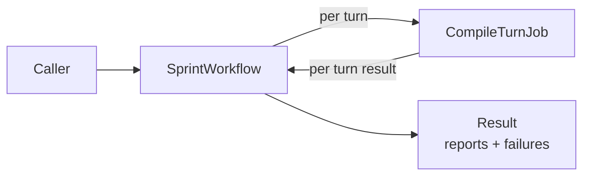

# SprintWorkflow

**Location**: `lib/sfl/compiler/workflows/sprint_workflow.rb`
**Confidence**: INFERRED
**Community**: Parallel Processing

---

## Transformation Contract

`SprintWorkflow` **transforms** a list of file paths plus analysis options
**into** a collection of report artifacts and per-item failure records
**through** sequential or Gush-distributed processing of each path.

---

## Responsibilities

- Accept a list of paths, a command (`:conversation` or `:documentation`), and
  output options.
- Run the chosen analysis for each path.
- Capture successful report paths in `result.reports`.
- Capture per-path errors in `result.failures` without aborting the batch.
- Optionally write a batch summary file to the output directory.

---

## Key Components

| Component | Type | Role |
|-----------|------|------|
| `SprintWorkflow` | Gush workflow / class | Orchestrates the batch |
| `run(paths:, command:, ...)` | Method | Public entry point |
| `Result` / report object | Struct | Holds `reports` and `failures` |
| `CompileTurnJob` | Sidekiq worker | Used when `require_jobs: true` |

---

## Dependencies

**Requires**:
- `Bootstrap.call(require_jobs: true)` if distributed mode is desired.
- A set of valid analysis commands (`:conversation`, `:documentation`).
- Redis when running with the Gush/Sidekiq adapter.

**Enables**:
- Batch ingestion from cron jobs, directory watchers, or CI pipelines.
- Downstream dashboards that consume `result.to_h` or the batch summary JSON.

---

## Interactions



---

## User/Developer Experience

Use `SprintWorkflow` directly from Ruby code for batch jobs:

```ruby
workflow = SFL::Compiler::Workflows::SprintWorkflow.new
result = workflow.run(
  paths: Dir["conversations/*.jsonl"],
  command: :conversation,
  output_dir: "./output/sprint-#{Date.today}",
  narrative: true
)

puts "Wrote #{result.reports.size} reports"
result.failures.each { |f| warn "#{f[:path]}: #{f[:error]}" }
```

For a single conversation, the CLI's `conversation --live` command is the
simpler option; `SprintWorkflow` is intended for multi-file batches.

---

## Known Limitations

- There is no dedicated CLI subcommand for batch directory processing yet;
  callers must use the Ruby API.
- Failure messages are captured as strings; complex exception backtraces are
  not serialized by default.

---

## Design Rationale

Batch operations in production rarely succeed or fail atomically. A malformed
file in a directory of otherwise valid conversations should not abort a nighty
job. Collecting failures lets operators fix the bad inputs and re-run just
those files instead of replaying the entire batch.

---

## Ruby Pragmatist Insight

`SprintWorkflow` is a delivery route that notes which houses had locked gates
instead of returning the whole truck to the depot. The mail that could be
delivered still reaches its destination.
